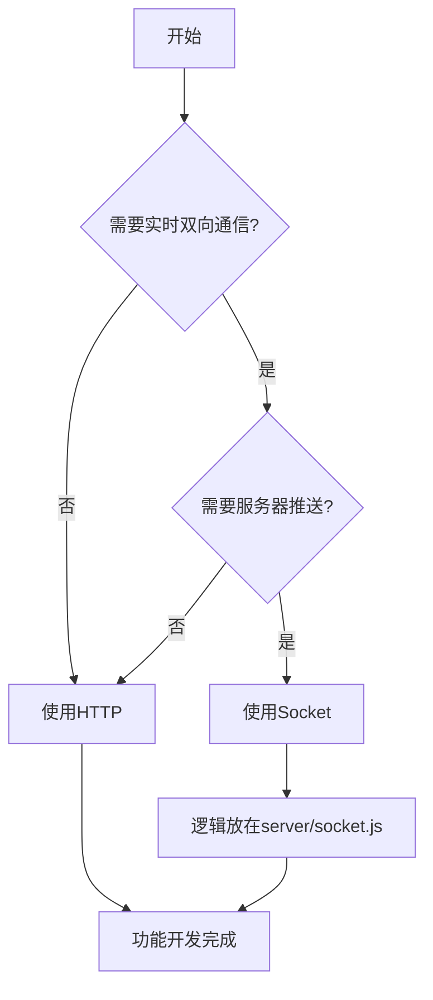

# 能量山项目代理入口

## 项目概览

**能量山：零号协议** 是一个基于 Node.js + Express + Socket.io 的多人在线游戏平台，集成AI分身客服系统。

### 技术栈

| 技术 | 用途 |
|------|------|
| **Node.js** | 后端运行时 |
| **Express** | HTTP API框架 |
| **Socket.io** | 实时通信（游戏操作、客服对话） |
| **MySQL** | 主数据库（用户、游戏数据、配置） |
| **Redis** | 缓存（验证码、PK数值、游戏状态） |
| **MongoDB** | 日志存储（AI对话历史、对战记录） |

### 核心功能模块

1. **游戏模块** (`game.html`)
   - 节点占据与PK对战
   - 能量系统
   - 排行榜

2. **AI分身客服** (`agent-chat.html`)
   - 自定义AI角色
   - 知识库管理
   - 关键词匹配

3. **玩家广场** (`plaza.html`)
   - 帖子发布与互动
   - PK团系统

4. **播客系统** (`podcast*.html`)
   - 音频上传与播放
   - 订阅管理

---

## 核心架构文件（必须阅读）

| 文件路径 | 作用 | 重要程度 |
|----------|------|----------|
| `server/app.js` | Express入口，路由注册，中间件配置 | 必读 |
| `server/socket.js` | Socket.io核心，所有实时通信入口 | 必读 |
| `server/routes/auth.js` | 用户认证（登录/注册/Token验证） | 必读 |
| `server/utils/db.js` | MySQL统一操作入口 | 必读 |
| `server/utils/cache.js` | Redis缓存统一管理 | 必读 |
| `server/utils/minimax.js` | AI对话核心逻辑 | AI功能必读 |
| `server/middleware/auth.js` | 认证中间件，管理员权限 | 必读 |

### 路由文件组织

```
server/routes/
├── auth.js              # 登录/注册/用户信息
├── plaza.js            # 玩家广场API
├── podcast.js          # 播客系统API
├── agent-chat.js       # 客服对话HTTP接口
├── agent-avatars.js    # AI分身管理
├── agent-knowledge.js  # 知识库管理
├── chess.js            # 象棋游戏API
├── battles.js          # PK对战API
├── leaderboard.js      # 排行榜API
└── admin*.js           # 管理后台API
```

---

## 通信方式决策（重要）

**在开发任何新功能前，必须先确定使用的通信方式。**

### 决策流程



### 场景对照表

| 功能模块 | 通信方式 | 核心文件 | 备注 |
|---------|---------|----------|------|
| 节点占据/移动 | Socket | `server/socket.js` | 实时位置同步 |
| PK对战 | Socket | `server/socket.js` | 实时数值计算 |
| 客服对话 | Socket | `server/socket.js` (agentChatIO) | 实时消息推送 |
| 用户注册/登录 | HTTP | `server/routes/auth.js` | 简单CRUD |
| 获取帖子列表 | HTTP | `server/routes/plaza.js` | 请求-响应模式 |
| 播客管理 | HTTP | `server/routes/podcast.js` | CRUD操作 |
| 管理员审核 | HTTP | `server/routes/admin*.js` | 后台操作 |

### Socket通信核心规则

1. **禁止在HTTP路由中直接操作Socket逻辑**，应抽离为独立函数
2. **所有游戏逻辑必须在服务端计算**（PK结果、能量计算）
3. **连接时必须验证JWT Token**
4. **监听事件前必须先off避免重复注册**

---

## API响应格式规范

### 响应格式（强制）

```javascript
// 成功响应
{ success: true, data: {...}, message: '操作成功' }

// 失败响应
{ success: false, error: '错误信息' }

// 分页响应
{ success: true, data: [...], pagination: { page: 1, limit: 20, total: 100 } }
```

### 字段命名（强制）

**所有API响应必须使用下划线命名（snake_case）：**

```javascript
// 正确示例
{
  success: true,
  data: {
    likes_count: 10,        // 点赞数
    comments_count: 5,     // 评论数
    views_count: 100,      // 浏览数
    created_at: '2026-01-01T00:00:00Z',  // 创建时间
    updated_at: '2026-01-01T00:00:00Z',  // 更新时间
    is_liked: false,       // 是否点赞
    user_id: 1,            // 用户ID
    post_id: 100           // 帖子ID
  }
}

// 错误示例（禁止使用驼峰）
{
  success: true,
  data: {
    likesCount: 10,        // 错误！
    commentsCount: 5,     // 错误！
    createdAt: '...'      // 错误！
  }
}
```

### 常见字段映射表

| 业务场景 | 后端返回字段 | 前端使用示例 |
|----------|-------------|-------------|
| 点赞数 | `likes_count` | `post.likes_count` |
| 评论数 | `comments_count` | `post.comments_count` |
| 浏览数 | `views_count` | `post.views_count` |
| 创建时间 | `created_at` | `post.created_at` |
| 更新时间 | `updated_at` | `post.updated_at` |
| 是否点赞 | `is_liked` | `post.is_liked` |
| 用户ID | `user_id` | `post.user_id` |
| 帖子ID | `post_id` | `comment.post_id` |

### 能量值保护（强制）

能量值必须使用 `Math.max(0, ...)` 保护，防止返回负数：

```javascript
// 正确
user_energy: Math.max(0, user.energy || 0)

// 错误 - 负数不生效（-10 || 0 返回 -10）
user_energy: user.energy || 0
```

---

## 前端状态管理

### 登录Token（强制）

- **必须使用**：`localStorage.getItem('authToken')`
- **禁止使用**：`token`、`token2`、`accessToken` 等其他key
- 所有需要认证的请求必须携带：`Authorization: Bearer ${token}`

### API_BASE 常量

前端所有API请求必须使用项目的API_BASE常量：

```javascript
const API_BASE = '';  // 同源请求
// 或
const API_BASE = 'https://your-domain.com';
```

### Socket连接

```javascript
// 正确的Socket连接方式
const socket = io(API_BASE + '/game', {
  auth: { token: localStorage.getItem('authToken') }
});

// 监听前必须先off
socket.off('player_update');
socket.on('player_update', handlePlayerUpdate);
```

---

## 数据库操作规范

### 参数化查询（强制）

所有SQL必须使用参数化查询，防止SQL注入：

```javascript
// 正确
const users = await db.query('SELECT * FROM users WHERE id = ?', [userId]);

// 错误 - SQL注入风险
const users = await db.query(`SELECT * FROM users WHERE id = ${userId}`);
```

### 事务使用

能量扣减等敏感操作必须使用事务：

```javascript
await db.transaction(async (conn) => {
  await conn.execute(
    'UPDATE users SET energy = GREATEST(0, energy - ?) WHERE id = ?',
    [cost, userId]
  );
  await conn.execute(
    'INSERT INTO user_game_records (user_id, action, amount) VALUES (?, ?, ?)',
    [userId, 'chat', cost]
  );
});
```

---

## 开发自检清单

每次开发完成后，必须检查：

### 基础检查
- [ ] API返回字段是否符合下划线命名规范？
- [ ] 错误处理是否完整（try-catch + console.error）？
- [ ] 是否有新的缓存逻辑？是否需要清除缓存？

### 前后端通信
- [ ] Socket通信与HTTP响应是否一致？
- [ ] 前端是否正确处理新的响应字段？
- [ ] 新功能是否在正确的通信方式中实现？

### 能量系统
- [ ] 能量扣减是否使用了 `GREATEST(0, ...)` 保护？
- [ ] 能量增加是否有正确的上限处理？
- [ ] API返回能量值是否使用 `Math.max(0, ...)` 保护？

### 数据库操作
- [ ] 是否使用参数化查询？
- [ ] 敏感操作是否使用事务？

---

## 常见问题速查

### 问题1：API返回字段名与前端不一致

**解决**：确保后端返回下划线命名（snake_case），参考上面的字段映射表

### 问题2：登录状态不共享

**解决**：检查是否使用统一的 `authToken` key

### 问题3：Socket功能不生效

**解决**：确认功能逻辑是否在 `server/socket.js` 中实现（不是HTTP路由）

### 问题4：能量显示负数

**解决**：API返回能量值使用 `Math.max(0, ...)`

### 问题5：前端显示点赞数为0

**解决**：检查后端返回字段名是 `likes_count` 还是 `likesCount`

---

## 相关规范文件

- [aibot-dev-standard.mdc](mdc:.cursor/rules/aibot-dev-standard.mdc) - 开发规范
- [aibot-development-experience.mdc](mdc:.cursor/rules/aibot-development-experience.mdc) - 开发经验
