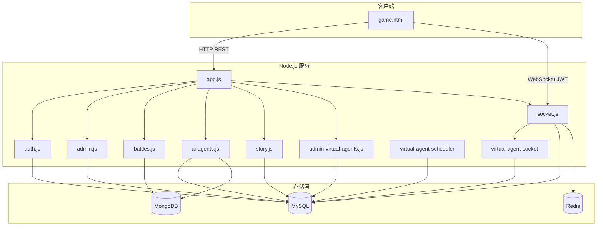
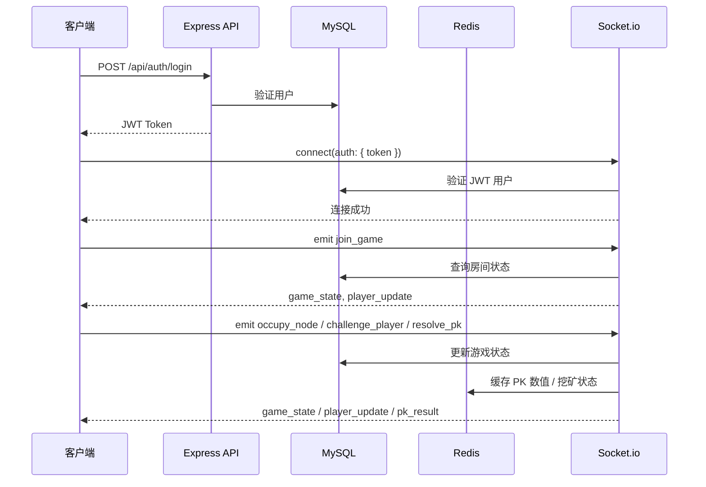

# 能量山 - 架构设计文档

## 1. 概述

能量山（能量山：零号协议 | PROJECT: ZERO）是一款 PK 实时联网多人在线游戏，采用服务端权威架构，通过 HTTP 完成认证、通过 WebSocket（Socket.io）完成实时游戏交互。

**核心特性**：
- 用户认证（JWT）
- 节点占据与挖矿（能量/体力）
- 玩家间 PK 对战（含虚拟智能体）
- 剧情章节与任务、AI 智能体对话、对战记录
- 实时状态同步、平台池机制

## 2. 架构图

说明：MongoDB 用于对战日志（battle_logs）、AI 工作台会话与对话历史、AI 智能体短期/中期/长期记忆；ai-agents 路由中智能体元数据与能量扣减仍用 MySQL。详见 [MONGODB_BATTLE_LOGS.md](MONGODB_BATTLE_LOGS.md)、[AI_STUDIO_AND_MEMORY_STORAGE.md](AI_STUDIO_AND_MEMORY_STORAGE.md)。

### 数据流向

## 3. 模块说明

| 模块 | 路径 | 职责 |
|------|------|------|
| HTTP 入口 | server/app.js | Express 应用、中间件、路由挂载、健康检查、错误处理 |
| 认证路由 | server/routes/auth.js | 验证码、注册、登录、获取当前用户 |
| 管理路由 | server/routes/admin.js | 用户管理、封禁、数据修改、配置、统计、日志、auth-code、test-minimax |
| 对战记录路由 | server/routes/battles.js | 从 MongoDB 查询当前用户对战记录（分页） |
| 剧情路由 | server/routes/story.js | 章节列表、章节详情、用户进度、任务完成/进度更新、章节完成 |
| AI 智能体路由 | server/routes/ai-agents.js | 智能体初始化、对话、图像/视频/语音、记忆、模型配置与偏好、知识库 |
| 虚拟智能体管理路由 | server/routes/admin-virtual-agents.js | 虚拟智能体 CRUD、上线/下线、统计、对战记录（管理员） |
| Socket 服务 | server/socket.js | 游戏房间、节点占据、挖矿、PK 挑战与结算（含虚拟智能体）、定时任务、剧情进度推送 |
| 虚拟智能体调度器 | server/services/virtual-agent-scheduler.js | 虚拟智能体占据节点、PK 行为调度 |
| 虚拟智能体 Socket | server/services/virtual-agent-socket.js | 虚拟智能体 PK 挑战接受、数值设置、结算与 Socket 注册 |
| 配置 | server/config/database.js | MySQL、Redis、MongoDB、JWT、服务端口、CORS |
| 工具 | server/utils/db.js | MySQL 连接池与查询 |
| 工具 | server/utils/redis.js | Redis 缓存封装 |
| 工具 | server/utils/captcha.js | 验证码生成与校验 |
| 中间件 | server/middleware/auth.js | JWT 校验、管理员校验、操作日志 |
| 前端 | game.html | 登录/注册、主界面、节点地图、PK 界面、剧情、AI 对话等 |

## 4. 认证与权限

### 认证流程

1. **HTTP 认证**：用户通过 `POST /api/auth/login` 或 `POST /api/auth/register` 获取 JWT
2. **Socket 握手**：`io(url, { auth: { token } })` 在握手时携带 JWT
3. **Socket 中间件**：`io.use()` 验证 JWT，校验用户存在且 `status = 'active'`
4. **API 接口**：`Authorization: Bearer <token>` 或 Cookie 携带 Token

### 权限模型

- **普通用户**：可登录、占据节点、挖矿、PK
- **管理员**：在 `users.is_admin = 1` 时可访问 `/api/admin/*`，执行封禁、修改用户、配置等操作

## 5. 实时通信模型

### 房间模型

- 房间 ID 默认 `1`，对应 `game_rooms` 表
- Socket 加入 `room_1` 后接收房间内广播
- 在线用户映射：`connectedUsers: Map<userId, socketId>`

### 事件方向

- **C->S**：`join_game`、`occupy_node`、`start_mining`、`challenge_player`、`pk_set_values`、`reject_pk_challenge`、`resolve_pk`、`leave_game`
- **S->C**：`game_state`、`player_update`、`pk_challenge`、`pk_matched_virtual`、`pk_result`、`treasure_claimed`、`treasure_node_revealed`、`task_progress_ready`、`system_message`

### 广播策略

- `io.to('room_X')`：房间内所有玩家
- `socket.emit()`：仅当前连接
- `io.to(socketId)`：指定玩家

## 6. 数据一致性

| 数据类型 | 存储 | 用途 |
|----------|------|------|
| 用户、房间、节点、配置、剧情与任务、AI 智能体元数据 | MySQL | 持久化、事务、外键、权威数据源 |
| 验证码 | Redis | 临时校验 |
| PK 数值（king, assassin） | Redis | 300 秒临时存储，确保结算时双方已提交 |
| 挖矿状态 | Redis | 标记用户正在挖矿 |
| 节点占用缓存 | Redis | 可选缓存，3600 秒 |
| 对战详细日志 | MongoDB | battle_logs 集合，含拒绝/超时；与 MySQL pk_records 互补 |
| AI 工作台会话线程与按会话的对话历史 | MongoDB | agent_conversation_threads、agent_conversations（带 threadId）；查询优先 MongoDB，回退 MySQL |
| AI 智能体短期/中期/长期记忆 | MongoDB | agent_memories 集合；读写优先 MongoDB，读可回退 MySQL |

**原则**：游戏状态与账户相关以 MySQL 为准；Redis 用于临时/缓存；MongoDB 负责对战日志、AI 工作台历史与会话、AI 记忆；定时任务（挖矿、体力恢复、平台池广播）从 MySQL 读取并写入。

## 7. 扩展与性能考虑

- **水平扩展**：当前单进程，多实例需使用 Socket.io Redis Adapter 实现跨进程房间广播
- **数据库**：连接池已配置，可按需调整 `connectionLimit`
- **Redis**：可选，未连接时验证码等功能降级，其他逻辑可独立运行
- **服务端权威**：PK 结算、能量变化均在服务端计算，客户端只做展示
