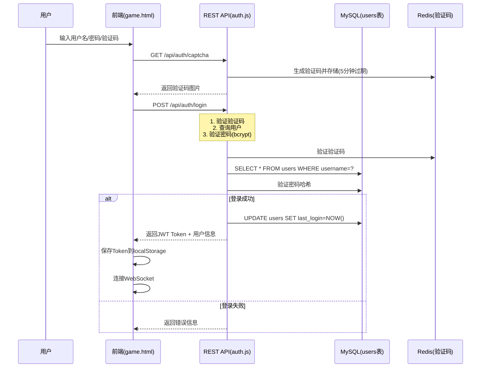
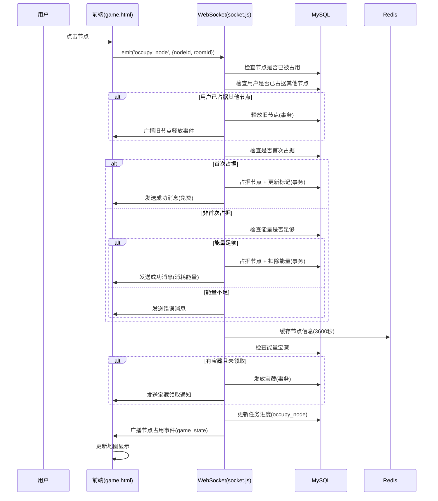
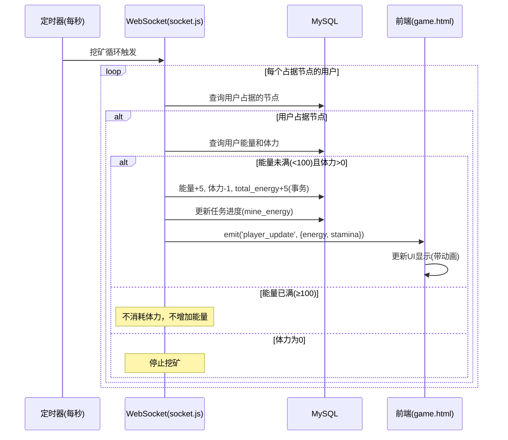
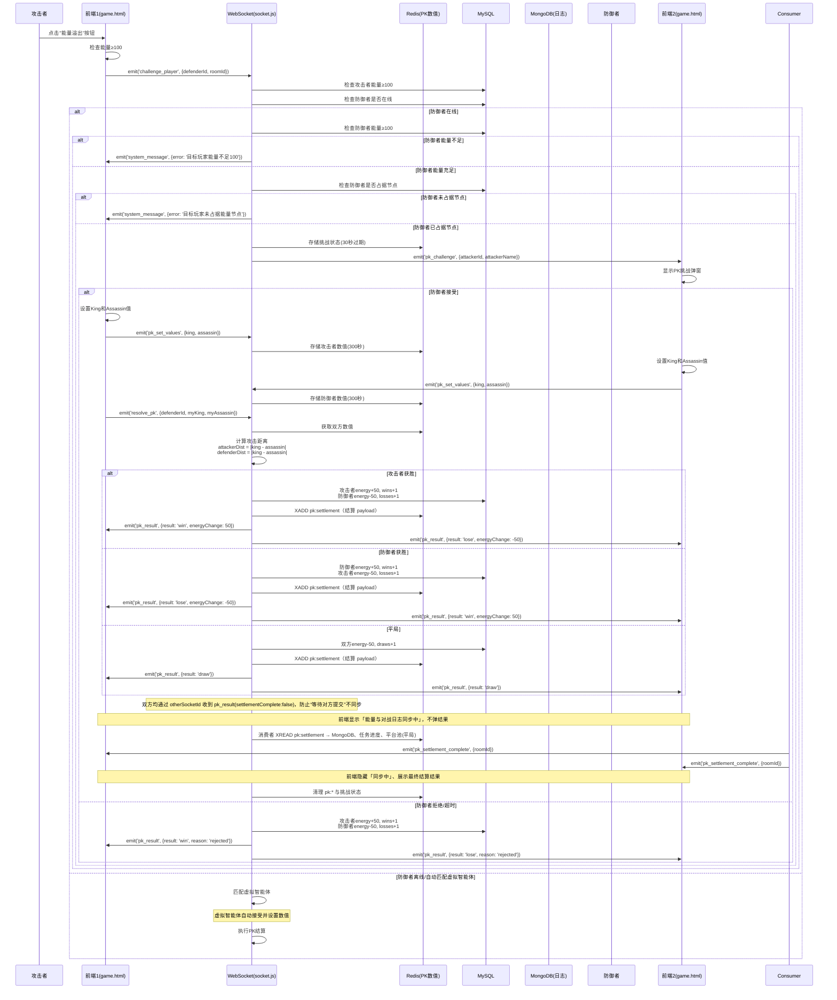
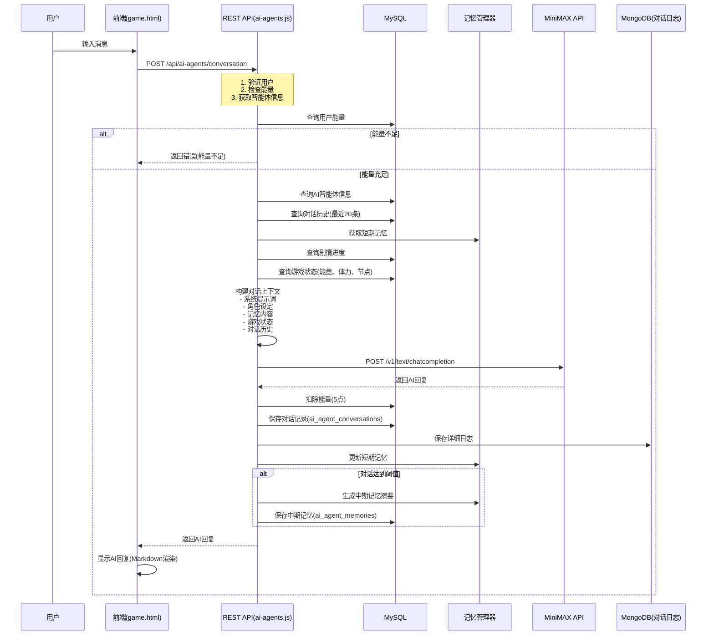
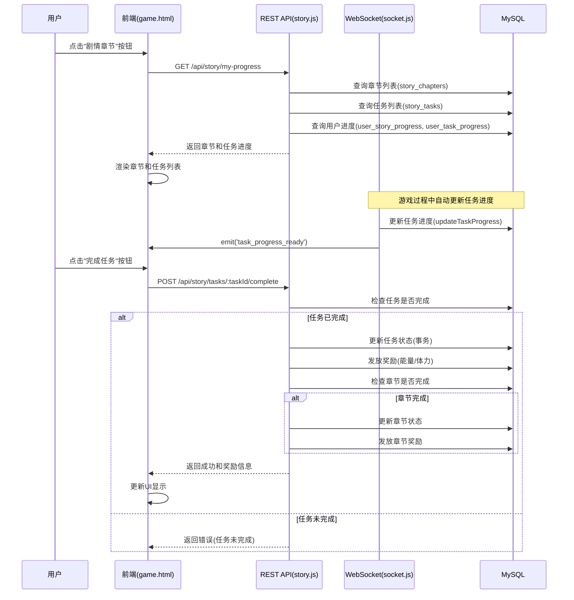
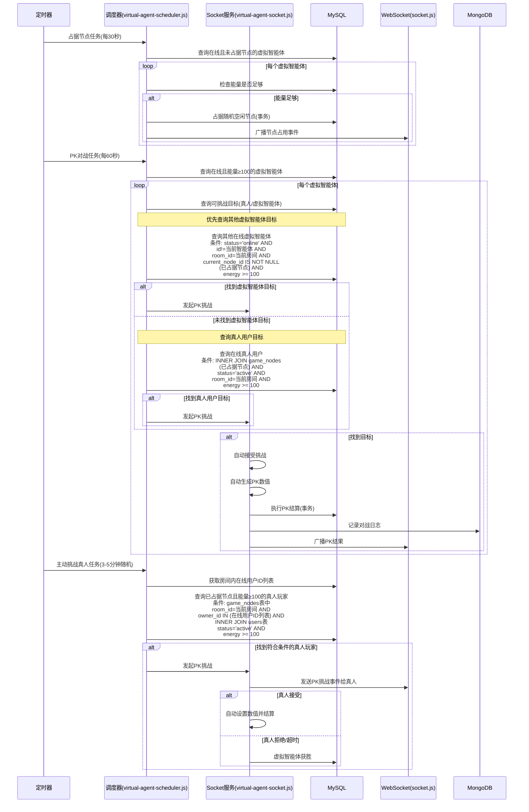
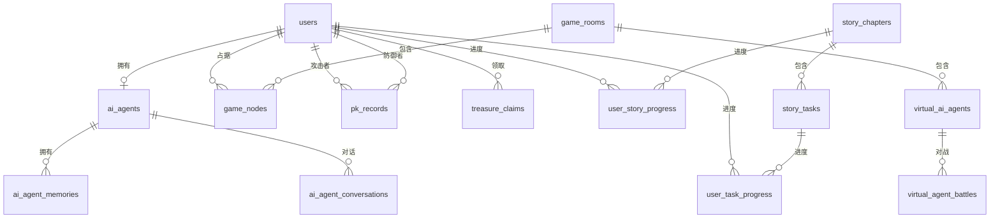

# 游戏系统数据流与业务逻辑总结文档

## 目录

1. [系统架构概览](#1-系统架构概览)
2. [数据流图](#2-数据流图)
3. [业务逻辑详解](#3-业务逻辑详解)
4. [数据库设计](#4-数据库设计)
5. [代码文件清单](#5-代码文件清单)

---

## 1. 系统架构概览

### 1.1 技术栈

**前端：**
- HTML5 + JavaScript (ES6+)
- Socket.io Client 4.6.1
- 单文件架构（所有前端代码集中在 `game.html`）

**服务端：**
- Node.js + Express.js
- Socket.io (WebSocket实时通信)
- JWT认证
- bcrypt密码加密

**数据库：**
- MySQL（主数据库，存储用户、游戏状态、配置等）
- Redis（缓存和临时数据：验证码、PK数值、节点缓存）
- MongoDB（对战日志存储）

**外部服务：**
- MiniMAX API（AI对话、图像生成、视频生成、语音合成）

### 1.2 三层架构

```
┌─────────────────────────────────────────┐
│           前端层 (Frontend)              │
│  game.html - 单文件应用                 │
│  - 用户界面渲染                          │
│  - 用户交互处理                          │
│  - WebSocket客户端                       │
│  - REST API调用                          │
└──────────────┬──────────────────────────┘
               │
               │ HTTP REST API
               │ WebSocket (Socket.io)
               │
┌──────────────▼──────────────────────────┐
│         服务端层 (Backend)              │
│  Express.js + Socket.io                 │
│  - REST API路由处理                     │
│  - WebSocket实时通信                    │
│  - 业务逻辑处理                         │
│  - 数据验证与安全                       │
└──────────────┬──────────────────────────┘
               │
               │ SQL查询/更新
               │ Redis操作
               │ MongoDB操作
               │
┌──────────────▼──────────────────────────┐
│         数据存储层 (Storage)             │
│  MySQL - 主数据存储                      │
│  Redis - 缓存与临时数据                 │
│  MongoDB - 日志存储                     │
└─────────────────────────────────────────┘
```

### 1.3 通信协议

**REST API：**
- 基础URL：`https://aibotdemo.skym178.com/api`
- 认证方式：`Authorization: Bearer <JWT_TOKEN>`
- 请求格式：JSON
- 响应格式：JSON

**WebSocket (Socket.io)：**
- 连接URL：`https://aibotdemo.skym178.com`
- 认证方式：连接时通过 `auth: { token: <JWT_TOKEN> }` 传递
- 事件驱动：双向通信

---

## 2. 数据流图

### 2.1 用户认证流程



**关键代码位置：**
- 前端：`game.html` - `auth.login()` 函数（约第200-250行）
- 服务端：`server/routes/auth.js` - `POST /register` 和 `POST /login`（约第46-150行）
- 数据库：`users` 表存储用户信息

### 2.2 节点占据流程



**关键代码位置：**
- 前端：`game.html` - `game.occupySlot()` 函数（约第1500-1600行）
- 服务端：`server/socket.js` - `socket.on('occupy_node')` 事件处理（约第451-700行）
- 数据库：`game_nodes` 表（节点占据状态）、`users` 表（能量扣除）、`treasure_claims` 表（宝藏记录）

### 2.3 挖矿流程



**关键代码位置：**
- 服务端：`server/socket.js` - 挖矿循环（约第1400-1500行）
- 数据库：`users` 表（energy, stamina, total_energy字段）

### 2.4 PK对战流程



**关键代码位置：**
- 前端：`game.html` - `game.openPK()` 和 `game.resolveCombat()` 函数（约第1700-2000行）
- 服务端：`server/socket.js` - `socket.on('challenge_player')`、`socket.on('resolve_pk')`、`consumePkSettlement` / `startPkSettlementConsumer`
  - 攻击者检查逻辑：是否已占据节点（未占据则返回「需要占据能量节点才能发起PK」）
  - 防御者检查逻辑（约第1000-1020行）：在线检查、能量检查（≥100）、节点占据检查
  - **resolve_pk**：计算胜负后更新 MySQL 能量/战绩、插入 `pk_records`，向**提交方**和**另一方（otherSocketId）**均发送 `pk_result` 与 `player_update`，再 XADD 至 `pk:settlement`；清理 `pk:*` 与挑战状态
  - **PK 结算消费者**：轮询 `pk:settlement`（XREAD），执行 MongoDB 对战日志、任务进度（complete_pk）、平局时平台池更新并广播
- Redis：PK 数值 key `pk:${userId}`（300 秒）；挑战状态 `pk_challenge:${defenderId}:${attackerId}`（30 秒）；**Stream** `pk:settlement`（结算 payload，由消费者处理 MongoDB/任务/平台池）
- 数据库：`pk_records` 表（对战记录）、`users` 表（能量和战绩更新）、`game_nodes` 表（节点占据检查）
- MongoDB：`battles` 集合（详细对战日志，由 pk:settlement 消费者写入）

### 2.5 AI智能体对话流程



**关键代码位置：**
- 前端：`game.html` - `agentChat.sendMessage()` 函数（约第2500-2700行）
- 服务端：`server/routes/ai-agents.js` - `POST /conversation`（约第200-400行）
- 数据库：`ai_agents` 表（智能体信息）、`ai_agent_conversations` 表（对话记录）、`ai_agent_memories` 表（记忆）
- 工具：`server/utils/memory-manager.js`（记忆管理）

### 2.6 剧情系统流程



**关键代码位置：**
- 前端：`game.html` - `storySystem` 模块（约第2800-3200行）
- 服务端：`server/routes/story.js` - 剧情路由（全文件）
- WebSocket：`server/socket.js` - 挖矿/占据等逻辑中更新任务进度并 emit `task_progress_ready`
- 数据库：`story_chapters` 表（章节）、`story_tasks` 表（任务）、`user_story_progress` 表（章节进度）、`user_task_progress` 表（任务进度）

### 2.7 虚拟智能体流程



**关键代码位置：**
- 服务端：`server/services/virtual-agent-scheduler.js` - 调度器（约第1-469行）
- 服务端：`server/services/virtual-agent-socket.js` - Socket服务（约第1-955行）
- 数据库：`virtual_ai_agents` 表（虚拟智能体状态）、`virtual_agent_battles` 表（对战记录）

---

## 3. 业务逻辑详解

### 3.1 认证模块

**功能描述：**
用户注册、登录、验证码生成与验证。

**数据流向：**
1. 前端请求验证码 → 服务端生成并存储到Redis → 返回验证码图片
2. 前端提交登录/注册信息 → 服务端验证 → 生成JWT → 返回Token和用户信息

**关键代码位置：**
- 前端：`game.html` - `auth` 对象（约第100-300行）
  - `auth.login()` - 登录函数
  - `auth.register()` - 注册函数
  - `auth.refreshCaptcha()` - 刷新验证码
- 服务端：`server/routes/auth.js`（约第1-269行）
  - `GET /api/auth/captcha` - 获取验证码
  - `POST /api/auth/register` - 用户注册
  - `POST /api/auth/login` - 用户登录
  - `POST /api/auth/logout` - 用户登出
  - `GET /api/auth/me` - 获取当前用户信息

**数据库操作：**
- `users` 表：
  - 注册：`INSERT INTO users (username, password, energy, stamina)`
  - 登录：`SELECT * FROM users WHERE username = ?`
  - 更新：`UPDATE users SET last_login = NOW() WHERE id = ?`

**错误处理：**
- 验证码错误或过期
- 用户名已存在
- 密码长度不符合要求
- 速率限制（15分钟10次请求）

### 3.2 游戏核心模块

#### 3.2.1 节点占据

**功能描述：**
用户占据游戏节点，首次占据免费，后续占据需要消耗能量。

**数据流向：**
1. 前端点击节点 → WebSocket发送 `occupy_node` 事件
2. 服务端检查节点状态 → 释放旧节点（如有）→ 检查能量 → 占据节点 → 更新数据库
3. 服务端检查能量宝藏 → 发放宝藏（如有）→ 广播状态更新

**关键代码位置：**
- 前端：`game.html` - `game.occupySlot()` 函数（约第1500-1600行）
- 服务端：`server/socket.js` - `socket.on('occupy_node')`（约第451-700行）

**数据库操作：**
- `game_nodes` 表：
  - 查询：`SELECT owner_id FROM game_nodes WHERE room_id = ? AND node_id = ?`
  - 更新：`UPDATE game_nodes SET owner_id = ?, occupied_at = NOW() WHERE room_id = ? AND node_id = ?`
- `users` 表：
  - 首次占据：`UPDATE users SET has_used_first_free_occupy = 1 WHERE id = ?`
  - 后续占据：`UPDATE users SET energy = energy - ? WHERE id = ?`
- `treasure_claims` 表：
  - 查询：`SELECT id FROM treasure_claims WHERE room_id = ? AND node_id = ?`
  - 插入：`INSERT INTO treasure_claims (user_id, room_id, node_id, amount) VALUES (?, ?, ?, ?)`

**业务规则：**
- 每个用户同时只能占据一个节点
- 首次占据免费，后续占据消耗50点能量（可配置）
- 每个节点全局仅可被领取一次能量宝藏
- 占据节点后自动开始挖矿

#### 3.2.2 挖矿

**功能描述：**
用户占据节点后自动挖矿，每秒增加5点能量，消耗1点体力（能量满时不消耗体力）。

**数据流向：**
1. 定时器每秒触发 → 查询所有占据节点的用户 → 更新能量和体力 → 广播状态更新

**关键代码位置：**
- 服务端：`server/socket.js` - 挖矿循环（约第1400-1500行）

**数据库操作：**
- `users` 表：
  - 更新：`UPDATE users SET energy = energy + 5, stamina = stamina - 1, total_energy = total_energy + 5 WHERE id = ? AND energy < 100 AND stamina > 0`
  - 能量满时：`UPDATE users SET stamina = stamina WHERE id = ?`（不消耗体力）

**业务规则：**
- 每秒增加5点能量（可配置）
- 每秒消耗1点体力（能量≥100时不消耗）
- 能量上限100点（可配置）
- 体力为0时停止挖矿
- 自动更新 `total_energy` 累计能量

#### 3.2.3 PK对战

**功能描述：**
能量达到100时，用户可以向其他玩家发起PK挑战，通过设置King和Assassin值进行对战。

**数据流向：**
1. 前端发起挑战 → WebSocket发送 `challenge_player` 事件
2. 服务端检查攻击者已占据节点 → 检查攻击者能量≥100 → 检查防御者在线 → 检查防御者能量≥100 → 检查防御者是否占据节点
3. 服务端存储挑战状态到Redis → 发送挑战通知给防御者
4. 双方设置PK数值 → 存储到Redis → 提交结算
5. 服务端计算胜负 → 更新能量和战绩 → 记录对战日志 → 广播结果

**关键代码位置：**
- 前端：`game.html` - `game.openPK()` 和 `game.resolveCombat()` 函数（约第1700-2000行）
- 服务端：`server/socket.js` - `socket.on('challenge_player')` 和 `socket.on('resolve_pk')`（约第750-1200行）
  - 攻击者检查逻辑：是否已占据节点（未占据则返回「需要占据能量节点才能发起PK」）
  - 防御者检查逻辑（约第1000-1020行）：在线检查、能量检查（≥100）、节点占据检查

**数据库操作：**
- `users` 表：
  - 检查防御者能量：`SELECT energy FROM users WHERE id = ?`
  - 更新能量和战绩：`UPDATE users SET energy = energy + ?, wins = wins + 1 WHERE id = ?`
- `game_nodes` 表：
  - 检查防御者是否占据节点：`SELECT node_id FROM game_nodes WHERE owner_id = ? AND room_id = ?`
- `pk_records` 表：
  - 插入：`INSERT INTO pk_records (attacker_id, attacker_type, defender_id, defender_type, attacker_king, attacker_assassin, defender_king, defender_assassin, result, energy_change) VALUES (...)`
- `game_rooms` 表：
  - 平局时更新平台池：`UPDATE game_rooms SET platform_pool = platform_pool + 100 WHERE id = ?`

**Redis操作：**
- 挑战状态：`pk_challenge:${defenderId}:${attackerId}`（30秒过期）
- PK数值：`pk:${userId}`（300秒过期）
- **Redis Stream**：`pk:settlement` — 请求路径在结算后 XADD 一条 payload（双方 ID、房间、数值、结果等）；同进程消费者每 200ms XREAD，执行 MongoDB 对战日志、任务进度（complete_pk）、平局时平台池更新并广播，实现对战响应即时、其余事务由 stream 统一处理，防止对战响应不统一

**MongoDB操作：**
- `battles` 集合：记录详细对战日志（由 pk:settlement 消费者写入）

**业务规则：**
- 发起挑战需要攻击者已占据能量节点且能量≥100（`canPK = energy >= 100 && 当前用户在该房间已占据节点`）
- 防御者必须满足以下条件才能接受挑战：
  - 防御者在线
  - 防御者能量≥100
  - 防御者已占据能量节点
- 攻击距离 = |King - Assassin|，距离更小的一方获胜
- 胜者：能量+50，wins+1
- 败者：能量-50，losses+1
- 平局：双方能量-50，平台池+100，draws+1
- 拒绝/超时：攻击者获胜，防御者失败

### 3.3 AI智能体模块

**功能描述：**
用户可以与AI智能体进行对话，支持文本、图像、视频、语音生成。

**数据流向：**
1. 前端发送消息 → REST API接收
2. 服务端构建对话上下文（记忆、历史、游戏状态）→ 调用MiniMAX API
3. 服务端保存对话记录 → 更新记忆 → 扣除能量 → 返回AI回复

**关键代码位置：**
- 前端：`game.html` - `agentChat` 对象（约第2500-3500行）
  - `agentChat.sendMessage()` - 发送消息
  - `agentChat.loadConversationHistory()` - 加载对话历史
  - `agentChat.generateImage()` - 生成图像
  - `agentChat.createVideoTask()` - 创建视频任务
  - `agentChat.generateSpeech()` - 生成语音
- 服务端：`server/routes/ai-agents.js`（约第1-1704行）
  - `POST /api/ai-agents/conversation` - 对话
  - `POST /api/ai-agents/generate-image` - 生成图像
  - `POST /api/ai-agents/create-video-task` - 创建视频任务
  - `POST /api/ai-agents/generate-speech` - 生成语音
  - `GET /api/ai-agents/model-config` - 获取模型配置
  - `POST /api/ai-agents/model-preferences` - 保存参数偏好

**数据库操作：**
- `ai_agents` 表：
  - 查询：`SELECT * FROM ai_agents WHERE user_id = ?`
  - 初始化：`INSERT INTO ai_agents (user_id, name, role, appearance) VALUES (...)`
- `ai_agent_conversations` 表：
  - 插入：`INSERT INTO ai_agent_conversations (agent_id, user_message, agent_message, energy_cost) VALUES (...)`
- `ai_agent_memories` 表：
  - 查询：`SELECT * FROM ai_agent_memories WHERE agent_id = ? AND memory_type = ? ORDER BY created_at DESC LIMIT ?`
  - 插入：`INSERT INTO ai_agent_memories (agent_id, memory_type, content) VALUES (...)`

**业务规则：**
- 每次对话消耗5点能量（可配置）
- 对话历史保留最近20条
- 短期记忆：最近10条对话
- 中期记忆：每20条对话生成一次摘要
- 长期记忆：重要信息永久保存
- 图像/视频/语音生成需要功能开关启用

### 3.4 剧情系统模块

**功能描述：**
用户通过完成剧情任务获得奖励，推动游戏进度。

**数据流向：**
1. 前端加载剧情进度 → REST API查询章节和任务
2. 游戏过程中自动更新任务进度（通过WebSocket）
3. 用户完成任务 → REST API验证并发放奖励

**关键代码位置：**
- 前端：`game.html` - `storySystem` 对象（约第2800-3200行）
  - `storySystem.open()` - 打开剧情界面
  - `storySystem.loadProgress()` - 加载进度
  - `storySystem.completeTask()` - 完成任务
- 服务端：`server/routes/story.js`（约第1-627行）
  - `GET /api/story/chapters` - 获取所有章节列表（含任务）
  - `GET /api/story/chapters/:chapterId` - 获取章节详情与用户进度
  - `GET /api/story/my-progress` - 获取当前用户剧情进度摘要
  - `POST /api/story/tasks/:taskId/complete` - 完成任务并领取奖励
  - `POST /api/story/tasks/:taskId/progress` - 更新任务进度（绝对值或增量）
  - `POST /api/story/chapters/:chapterId/complete` - 完成章节并领取奖励
- WebSocket：`server/socket.js` - 挖矿/占据等逻辑中调用任务进度更新并 emit `task_progress_ready`

**数据库操作：**
- `story_chapters` 表：
  - 查询：`SELECT * FROM story_chapters WHERE is_active = 1 ORDER BY sort_order ASC`
- `story_tasks` 表：
  - 查询：`SELECT * FROM story_tasks WHERE chapter_id = ? AND is_active = 1`
- `user_story_progress` 表：
  - 查询：`SELECT * FROM user_story_progress WHERE user_id = ? AND chapter_id = ?`
  - 更新：`UPDATE user_story_progress SET is_completed = 1, completed_at = NOW() WHERE user_id = ? AND chapter_id = ?`
- `user_task_progress` 表：
  - 查询：`SELECT * FROM user_task_progress WHERE user_id = ? AND task_id = ?`
  - 更新：`UPDATE user_task_progress SET progress_value = ?, is_completed = 1 WHERE user_id = ? AND task_id = ?`

**任务类型：**
- `occupy_node` - 占据节点（统计占据的不同节点数）
- `mine_energy` - 挖掘能量（使用total_energy）
- `complete_pk` - 完成PK（统计PK次数）
- `find_treasure` - 发现宝藏（统计宝藏领取次数）
- `reach_energy` - 达到能量值（使用当前energy）
- `chat_with_ai` - 与AI对话（统计对话次数）

**业务规则：**
- 任务进度自动更新（通过WebSocket事件）
- 完成任务需要达到目标值
- 完成任务后发放能量/体力奖励
- 章节完成后发放章节奖励

### 3.5 虚拟智能体模块

**功能描述：**
系统自动运行的虚拟智能体，自动占据节点、发起PK、响应PK挑战。

**数据流向：**
1. 定时器触发调度任务 → 查询在线虚拟智能体 → 执行行为 → 更新数据库 → 广播事件

**关键代码位置：**
- 服务端：`server/services/virtual-agent-scheduler.js`（约第1-469行）
  - `occupyNodeTask()` - 占据节点任务（每30秒）
  - `pkBattleTask()` - PK对战任务（每60秒）
  - `challengeUserTask()` - 主动挑战真人任务（3-5分钟随机）
- 服务端：`server/services/virtual-agent-socket.js`（约第1-955行）
  - `handlePKChallenge()` - 处理PK挑战
  - `handlePKResponse()` - 处理PK响应
  - `resolvePK()` - PK结算

**数据库操作：**
- `virtual_ai_agents` 表：
  - 查询：`SELECT * FROM virtual_ai_agents WHERE status = 'online'`
  - 更新：`UPDATE virtual_ai_agents SET current_node_id = ?, energy = energy - ?, last_action_at = NOW() WHERE id = ?`
- `virtual_agent_battles` 表：
  - 插入：`INSERT INTO virtual_agent_battles (...) VALUES (...)`

**业务规则：**
- 占据节点：每30秒检查一次，能量足够时占据随机空闲节点
- PK对战：每60秒检查一次，能量≥100时发起PK
- 主动挑战真人：3-5分钟随机触发，挑战在线真人玩家
- 自动响应PK：根据能量状态计算接受概率，自动生成PK数值

### 3.6 管理后台模块

**功能描述：**
管理员可以管理用户、配置游戏参数、查看统计数据。

**关键代码位置：**
- 前端：`admin.html` - 管理后台界面
- 服务端：`server/routes/admin.js`（约第1-1000+行）
  - `GET /api/admin/users` - 用户列表
  - `PUT /api/admin/users/:id/ban` - 封禁用户
  - `PUT /api/admin/users/:id/stats` - 编辑用户能量/体力
  - `GET /api/admin/config` - 获取游戏配置
  - `PUT /api/admin/config` - 更新游戏配置
  - `GET /api/admin/stats` - 统计数据
- 服务端：`server/routes/admin-virtual-agents.js`（约第1-500+行）
  - `GET /api/admin/virtual-agents` - 虚拟智能体列表
  - `POST /api/admin/virtual-agents/create` - 创建虚拟智能体
  - `PUT /api/admin/virtual-agents/:id/online` - 上线智能体
  - `PUT /api/admin/virtual-agents/:id/stats` - 编辑能量/体力

**数据库操作：**
- `users` 表：用户管理操作
- `game_config` 表：配置管理
- `admin_logs` 表：操作日志记录

---

## 4. 数据库设计

完整 ER 图、表结构及 Migration 策略见 [DATABASE.md](DATABASE.md)。以下为业务相关要点摘要。

### 4.1 核心表结构

#### 4.1.1 用户相关表

**users（用户表）**
- `id` - 主键
- `username` - 用户名（唯一）
- `password` - 密码哈希（bcrypt）
- `energy` - 当前能量（0-1000）
- `stamina` - 当前体力（0-100）
- `total_energy` - 累计能量
- `wins/losses/draws` - PK战绩
- `has_used_first_free_occupy` - 是否使用过首次免费占据
- `is_admin` - 是否管理员
- `status` - 状态（active/banned）

**ai_agents（AI智能体表）**
- `id` - 主键
- `user_id` - 用户ID（外键，唯一）
- `name` - 智能体名称
- `role` - 角色设定（JSON）
- `appearance` - 形象设定（JSON）
- `model_preferences` - 模型参数偏好（JSON）
- `energy` - 智能体能量
- `is_initialized` - 是否已初始化

**ai_agent_memories（AI智能体记忆表）**
- `id` - 主键
- `agent_id` - 智能体ID（外键）
- `memory_type` - 记忆类型（short/medium/long）
- `content` - 记忆内容（TEXT）

**ai_agent_conversations（AI智能体对话记录表）**
- `id` - 主键
- `agent_id` - 智能体ID（外键）
- `user_message` - 用户消息（TEXT）
- `agent_message` - AI回复（TEXT）
- `energy_cost` - 能量消耗

#### 4.1.2 游戏相关表

**game_rooms（游戏房间表）**
- `id` - 主键
- `room_name` - 房间名称
- `max_players` - 最大玩家数
- `current_players` - 当前玩家数
- `platform_pool` - 平台池（平局时增加）

**game_nodes（游戏节点表）**
- `id` - 主键
- `room_id` - 房间ID（外键）
- `node_id` - 节点编号（1-100，与room_id组成唯一键）
- `owner_id` - 占据者ID（外键，可为NULL）
- `occupied_at` - 占据时间

**pk_records（PK战斗记录表）**
- `id` - 主键
- `attacker_id` - 攻击者ID
- `attacker_type` - 攻击者类型（user/virtual_agent）
- `defender_id` - 防御者ID
- `defender_type` - 防御者类型（user/virtual_agent）
- `attacker_king/assassin` - 攻击者数值（1-100）
- `defender_king/assassin` - 防御者数值（1-100）
- `result` - 结果（win/lose/draw）
- `energy_change` - 能量变化

**treasure_claims（能量宝藏领取记录表）**
- `id` - 主键
- `user_id` - 用户ID（外键）
- `room_id` - 房间ID
- `node_id` - 节点ID（与room_id组成唯一键）
- `amount` - 宝藏数量

#### 4.1.3 剧情系统表

**story_chapters（剧情章节表）**
- `id` - 主键
- `chapter_number` - 章节编号（唯一）
- `chapter_title` - 章节标题
- `chapter_description` - 章节描述
- `story_content` - 剧情内容（TEXT）
- `completion_condition` - 完成条件（JSON）
- `stamina_reward/energy_reward` - 奖励
- `is_active` - 是否激活

**story_tasks（任务线索表）**
- `id` - 主键
- `chapter_id` - 章节ID（外键）
- `task_type` - 任务类型
- `task_title` - 任务标题
- `task_description` - 任务描述
- `target_value` - 目标值
- `stamina_reward/energy_reward` - 奖励

**user_story_progress（用户剧情进度表）**
- `id` - 主键
- `user_id` - 用户ID（外键）
- `chapter_id` - 章节ID（外键，与user_id组成唯一键）
- `is_completed` - 是否完成

**user_task_progress（用户任务进度表）**
- `id` - 主键
- `user_id` - 用户ID（外键）
- `task_id` - 任务ID（外键，与user_id组成唯一键）
- `progress_value` - 进度值
- `is_completed` - 是否完成

#### 4.1.4 虚拟智能体表

**virtual_ai_agents（虚拟AI智能体表）**
- `id` - 主键
- `name` - 智能体名称
- `energy` - 当前能量
- `stamina` - 当前体力
- `status` - 状态（online/offline）
- `room_id` - 所在房间ID（外键）
- `current_node_id` - 当前占据的节点ID
- `wins/losses/draws` - 战绩
- `total_energy` - 累计能量
- `last_action_at` - 最后行动时间

**virtual_agent_battles（虚拟智能体对战记录表）**
- `id` - 主键
- `attacker_id` - 攻击者ID
- `attacker_type` - 攻击者类型
- `defender_id` - 防御者ID
- `defender_type` - 防御者类型
- `result` - 结果
- `attacker_energy_change/defender_energy_change` - 能量变化

#### 4.1.5 配置和日志表

**game_config（游戏配置表）**
- `id` - 主键
- `config_key` - 配置键（唯一）
- `config_value` - 配置值（TEXT/JSON）
- `description` - 配置说明

**admin_logs（管理员操作日志表）**
- `id` - 主键
- `admin_id` - 管理员ID（外键）
- `action` - 操作类型
- `target_id` - 目标ID
- `details` - 详细信息（JSON）

### 4.2 表关系图



### 4.3 数据流转说明

**MySQL（主数据库）：**
- 存储所有持久化数据：用户信息、游戏状态、配置、剧情数据等
- 作为数据权威源，所有关键操作都通过事务保证一致性

**Redis（缓存和临时数据）：**
- 验证码：`captcha:${captchaId}`（5分钟过期）
- PK挑战状态：`pk_challenge:${defenderId}:${attackerId}`（30秒过期）
- PK数值：`pk:${userId}`（300秒过期）
- **Redis Stream**：`pk:settlement` — PK 结算 payload，由同进程消费者 XREAD 后执行 MongoDB、任务进度、平台池（平局）
- 节点缓存：`game:room:${roomId}:node:${nodeId}`（3600秒过期）
- 挖矿状态：`mining:${userId}`（可选）

**MongoDB（日志存储）：**
- `battles` 集合：详细对战日志
- `conversations` 集合：AI对话详细日志（可选）

---

## 5. 代码文件清单

### 5.1 前端文件

| 文件路径 | 职责 | 关键函数/模块 |
|---------|------|-------------|
| `game.html` | 主游戏界面，包含所有前端逻辑 | `auth`（认证）、`game`（游戏核心）、`storySystem`（剧情）、`agentChat`（AI对话）、`agentDelivery`（AI初始化） |

### 5.2 服务端核心文件

| 文件路径 | 职责 | 关键功能 |
|---------|------|---------|
| `server/app.js` | Express应用入口 | 路由挂载、中间件配置、Socket.io初始化 |
| `server/socket.js` | WebSocket实时通信服务 | 房间管理、节点占据、挖矿循环、PK对战、任务进度更新 |

### 5.3 服务端路由文件

| 文件路径 | 职责 | 主要端点 |
|---------|------|---------|
| `server/routes/auth.js` | 认证相关路由 | `GET /api/auth/captcha`、`POST /api/auth/register`、`POST /api/auth/login`、`POST /api/auth/logout`、`GET /api/auth/me` |
| `server/routes/admin.js` | 管理后台路由 | `GET /api/admin/users`、`PUT /api/admin/users/:id/ban`、`GET /api/admin/config`、`PUT /api/admin/config`、`GET /api/admin/stats` |
| `server/routes/ai-agents.js` | AI智能体路由 | `POST /api/ai-agents/initialize`、`POST /api/ai-agents/conversation`、`POST /api/ai-agents/generate-image`、`POST /api/ai-agents/create-video-task`、`POST /api/ai-agents/generate-speech` |
| `server/routes/story.js` | 剧情系统路由 | `GET /api/story/chapters`、`GET /api/story/chapters/:chapterId`、`GET /api/story/my-progress`、`POST /api/story/tasks/:taskId/complete`、`POST /api/story/tasks/:taskId/progress`、`POST /api/story/chapters/:chapterId/complete` |
| `server/routes/battles.js` | 对战记录路由 | `GET /api/battles` |
| `server/routes/admin-virtual-agents.js` | 虚拟智能体管理路由 | `GET /api/admin/virtual-agents`、`POST /api/admin/virtual-agents/create`、`PUT /api/admin/virtual-agents/:id/online` |

### 5.4 服务端服务文件

| 文件路径 | 职责 | 关键功能 |
|---------|------|---------|
| `server/services/virtual-agent-socket.js` | 虚拟智能体Socket服务 | PK挑战处理、PK响应、PK结算、Socket注册/注销 |
| `server/services/virtual-agent-scheduler.js` | 虚拟智能体调度器 | 占据节点任务、PK对战任务、主动挑战真人任务 |

### 5.5 服务端工具文件

| 文件路径 | 职责 | 关键功能 |
|---------|------|---------|
| `server/utils/db.js` | MySQL数据库工具 | 连接池管理、查询封装、事务处理 |
| `server/utils/redis.js` | Redis缓存与 Stream 工具 | 连接管理、get/set/del、**xAdd/xRead**（pk:settlement 流）、支持降级 |
| `server/utils/mongo.js` | MongoDB工具 | 连接管理、集合操作 |
| `server/utils/captcha.js` | 验证码工具 | SVG生成、Redis存储、验证 |
| `server/utils/minimax.js` | MiniMAX API工具 | API调用封装、错误处理 |
| `server/utils/memory-manager.js` | 记忆管理器 | 短期记忆管理、中期记忆摘要生成 |
| `server/utils/pk-challenge-helper.js` | PK挑战辅助函数 | 挑战状态检查、参与者验证 |

### 5.6 服务端中间件文件

| 文件路径 | 职责 | 关键功能 |
|---------|------|---------|
| `server/middleware/auth.js` | 认证中间件 | JWT验证、管理员权限校验、操作日志记录 |

### 5.7 服务端配置文件

| 文件路径 | 职责 | 关键配置 |
|---------|------|---------|
| `server/config/database.js` | 数据库配置 | MySQL、Redis、MongoDB连接配置、JWT配置、服务器端口 |

### 5.8 数据库文件

| 文件路径 | 职责 | 说明 |
|---------|------|------|
| `database/init_env.sql` | 数据库初始化脚本 | 创建基础表结构 |
| `database/migrations/add_ai_agent_tables.sql` | AI智能体表结构 | 创建AI智能体相关表 |
| `database/migrations/add_virtual_ai_agents.sql` | 虚拟智能体表结构 | 创建虚拟智能体相关表 |
| `database/migrations/add_story_system.sql` | 剧情系统表结构 | 创建剧情系统相关表 |
| `database/migrations/add_energy_treasure.sql` | 能量宝藏表结构 | 创建宝藏领取记录表 |
| `database/migrations/init_story_data.sql` | 初始化剧情数据 | 插入初始章节和任务数据 |
| `database/migrations/add_config_extensions.sql` | 配置扩展 | 添加游戏配置项 |

### 5.9 配置文件

| 文件路径 | 职责 | 说明 |
|---------|------|------|
| `.env` | 环境变量配置 | MySQL、Redis、MongoDB连接信息、JWT密钥、API密钥等 |
| `.env.example` | 环境变量模板 | 环境变量示例文件 |
| `package.json` | Node.js项目配置 | 依赖管理、脚本定义 |

---

## 6. 总结

本文档系统梳理了游戏前端、服务端和数据库的完整数据流与业务逻辑，包括：

1. **系统架构**：三层架构（前端、服务端、数据库），使用REST API和WebSocket进行通信
2. **数据流图**：详细绘制了7个核心模块的数据流序列图
3. **业务逻辑**：详细说明了6个主要模块的功能、数据流向、关键代码位置和数据库操作
4. **数据库设计**：完整的表结构说明、表关系图和数据流转说明
5. **代码文件清单**：按模块分类列出了所有相关文件及其职责

该文档可作为系统维护、功能扩展和新人入职的参考资料。
