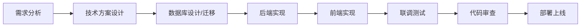

# 能量山项目开发规范 - 工程化开发范式

## 文档概述

本文档为能量山项目（Node.js + Express + Socket.io 多人在线游戏）建立完整的工程化开发规范，旨在将"vibe coding"（直觉驱动开发）转变为结构化、可维护、可扩展的工程开发范式。

---

## 一、项目工程结构规范

### 1.1 目录结构约定

```
aibot/
├── server/                      # 后端服务
│   ├── app.js                  # Express 应用入口
│   ├── socket.js               # Socket.io 核心服务
│   ├── config/                 # 配置目录
│   │   └── database.js         # 数据库配置（从 .env 加载）
│   ├── routes/                 # 路由目录（按功能模块拆分）
│   │   ├── auth.js            # 认证相关
│   │   ├── admin.js           # 管理后台
│   │   ├── battles.js        # 对战记录
│   │   ├── ai-agents.js      # AI 智能体
│   │   ├── story.js           # 剧情系统
│   │   ├── agent-chat.js     # 客服聊天
│   │   ├── agent-chat-admin.js # 分身客服后台
│   │   └── ...
│   ├── services/               # 服务层（复杂业务逻辑）
│   │   ├── virtual-agent-scheduler.js
│   │   ├── virtual-agent-socket.js
│   │   ├── message-queue.js
│   │   └── treasure-stream.js
│   ├── middleware/             # 中间件
│   │   └── auth.js            # JWT 认证、管理员权限
│   └── utils/                  # 工具函数
│       ├── db.js              # MySQL 封装
│       ├── redis.js           # Redis 封装
│       ├── mongo.js           # MongoDB 封装
│       ├── minimax.js         # AI API 封装
│       └── ...
├── public/                     # 静态资源
├── docs/                       # 项目文档
│   ├── migrations/            # 数据库迁移脚本
│   ├── ARCHITECTURE.md        # 架构设计
│   ├── DATABASE.md            # 数据模型
│   ├── API.md                 # 接口文档
│   └── ...
├── game.html                   # 游戏主页面
├── admin.html                  # 管理员后台
├── index.html                  # 入口页面
├── .env                        # 环境变量（不提交）
├── .env.example               # 环境变量模板
└── package.json               # 项目依赖
```

### 1.2 文件命名规范

| 类型 | 规范 | 示例 |
|------|------|------|
| 路由文件 | kebab-case | `auth.js`, `admin-game-codes.js` |
| 工具文件 | kebab-case | `db.js`, `pk-challenge-helper.js` |
| 服务文件 | kebab-case | `virtual-agent-scheduler.js` |
| 中间件 | kebab-case | `auth.js` |
| 前端页面 | kebab-case | `game.html`, `agent-chat.html` |

---

## 二、开发流程规范

### 2.1 新功能开发流程



### 2.2 Taskmaster 任务管理

项目使用 Taskmaster 进行任务管理，所有开发任务必须录入任务系统：

1. **初始化项目**：已有 tasks.json，从 `task-master list` 查看任务
2. **查看任务**：`task-master show <id>` 查看任务详情
3. **分解任务**：`task-master expand --id=<id>` 分解复杂任务
4. **更新进度**：`task-master set-status --id=<id> --status=in-progress`
5. **完成任务**：`task-master set-status --id=<id> --status=done`

### 2.3 分支管理策略

```
master     → 生产环境
develop    → 开发主分支
feature/*  → 功能开发分支
bugfix/*   → Bug 修复分支
hotfix/*   → 紧急修复分支
```

---

## 三、代码规范

### 3.1 JavaScript 编码规范

基于现有 CODE_STANDARDS.md，核心规范如下：

#### 3.1.1 命名规范

```javascript
// 变量/函数：camelCase
const userName = 'admin';
const maxPlayers = 100;
function getUserById(id) {}

// 常量：UPPER_SNAKE_CASE
const MAX_RETRY_COUNT = 3;
const DEFAULT_PORT = 3000;

// 类/构造函数：PascalCase
class UserService {}
function DatabaseConnection() {}

// 私有变量（可选）：下划线前缀
const _internalCache = {};
function _validateInput() {}
```

#### 3.1.2 导入顺序

```javascript
// 1. Node.js 内置模块
const path = require('path');
const crypto = require('crypto');

// 2. 第三方模块
const express = require('express');
const jwt = require('jsonwebtoken');
const mysql = require('mysql2/promise');

// 3. 项目内部模块
const db = require('../utils/db');
const redis = require('../utils/redis');
const { authenticateToken, requireAdmin } = require('../middleware/auth');
```

#### 3.1.3 代码结构

```javascript
// 1. 模块导入
const express = require('express');

// 2. 常量定义
const MAX_RETRY = 3;

// 3. 变量声明
let pool = null;

// 4. 函数定义
function getPool() {}
async function query() {}

// 5. 导出
module.exports = { getPool, query };
```

#### 3.1.4 异步处理

```javascript
// 推荐：async/await + try-catch
async function getUser(id) {
  try {
    const user = await db.query('SELECT * FROM users WHERE id = ?', [id]);
    return user[0];
  } catch (error) {
    console.error('查询用户失败:', error);
    throw error;
  }
}

// 不推荐：Promise.then()
function getUser(id) {
  return db.query('SELECT * FROM users WHERE id = ?', [id])
    .then(results => results[0]);
}
```

### 3.2 前端编码规范

#### 3.2.1 HTML 文件结构

```html
<!DOCTYPE html>
<html lang="zh-CN">
<head>
  <meta charset="UTF-8">
  <title>页面标题</title>
  <link rel="stylesheet" href="/public/css/style.css">
</head>
<body>
  <div id="app"></div>
  <script src="/socket.io/socket.io.js"></script>
  <script src="/public/js/config.js"></script>
  <script src="/public/js/main.js"></script>
</body>
</html>
```

#### 3.2.2 JavaScript 模块组织

```javascript
// IIFE 避免全局污染
(function() {
  'use strict';

  // 全局配置
  const API_BASE = 'http://localhost:3000';
  const SOCKET_URL = 'http://localhost:3000';

  // DOM 元素缓存
  let elements = {};

  // 初始化
  function init() {
    cacheElements();
    bindEvents();
    connectSocket();
  }

  function cacheElements() {
    elements.app = document.getElementById('app');
  }

  function bindEvents() {
    // 事件绑定
  }

  // 启动
  document.addEventListener('DOMContentLoaded', init);
})();
```

#### 3.2.3 Socket 事件监听规范

```javascript
// 正确：先移除旧监听器，避免重复注册
function initSocket() {
  socket.off('player_update');  // 先移除
  socket.on('player_update', handlePlayerUpdate);
}

// 错误：重复注册导致内存泄漏
function initSocket() {
  socket.on('player_update', handlePlayerUpdate);
}

// 组件卸载时清理
function cleanupSocket() {
  socket.off('player_update', handlePlayerUpdate);
}
```

---

## 四、数据库设计规范

### 4.1 存储选型原则

| 存储类型 | 存储内容 | 使用场景 |
|----------|----------|----------|
| **MySQL** | 用户、房间、节点、配置、剧情任务、AI智能体元数据 | 持久化、事务、外键、权威数据源 |
| **Redis** | 验证码、PK数值(king/assassin)、挖矿状态、节点占用缓存 | 临时数据与缓存 |
| **MongoDB** | 对战详细日志、AI工作台会话与对话历史、AI智能体记忆 | 大文档与历史数据 |

### 4.2 MySQL 表设计规范

```sql
-- 字符集统一
CREATE TABLE IF NOT EXISTS example_table (
  id INT(11) AUTO_INCREMENT PRIMARY KEY,
  name VARCHAR(50) NOT NULL,
  status ENUM('active', 'inactive') DEFAULT 'active',
  created_at DATETIME DEFAULT CURRENT_TIMESTAMP,
  updated_at DATETIME DEFAULT CURRENT_TIMESTAMP ON UPDATE CURRENT_TIMESTAMP,
  UNIQUE KEY idx_name (name),
  KEY idx_status (status)
) ENGINE=InnoDB DEFAULT CHARSET=utf8mb4 COLLATE=utf8mb4_unicode_ci;
```

### 4.3 数据库操作规范

```javascript
// 正确：使用 db.query 和参数化查询
const users = await db.query('SELECT * FROM users WHERE id = ?', [userId]);

// 正确：使用事务
await db.transaction(async (conn) => {
  await conn.execute('UPDATE users SET energy = ? WHERE id = ?', [energy, userId]);
  await conn.execute('INSERT INTO logs (user_id, action) VALUES (?, ?)', [userId, 'update']);
});

// 错误：字符串拼接 SQL（SQL注入风险）
const sql = `SELECT * FROM users WHERE id = ${userId}`;
```

### 4.4 MongoDB 操作规范

```javascript
// 正确：使用 mongo.js 封装
const conversation = await mongo.getAgentConversationThreads(agentId);

// 正确：降级处理
try {
  conversation = await mongo.getAgentConversationThreads(agentId);
} catch (err) {
  console.error('MongoDB查询失败，降级处理:', err.message);
  conversation = []; // 降级返回空数组
}
```

---

## 五、API 设计规范

### 5.1 RESTful 接口规范

| 方法 | 路径 | 说明 |
|------|------|------|
| GET | /api/users | 获取用户列表 |
| GET | /api/users/:id | 获取单个用户 |
| POST | /api/users | 创建用户 |
| PUT | /api/users/:id | 更新用户 |
| DELETE | /api/users/:id | 删除用户 |

### 5.2 响应格式规范

```javascript
// 成功响应
res.json({ success: true, data: {...}, message: '操作成功' });

// 失败响应
res.status(400).json({ error: '错误信息' });

// 分页响应
res.json({
  success: true,
  data: [...],
  pagination: {
    page: 1,
    limit: 20,
    total: 100
  }
});
```

### 5.3 字段命名规范（重要）

**必须保持后端返回字段与前端期望字段一致，否则会导致数据显示异常。**

#### 5.3.1 命名风格选择

本项目统一使用 **下划线命名（snake_case）** 风格：

```javascript
// 正确：后端返回下划线格式
res.json({
  success: true,
  data: {
    likes_count: 10,      // 下划线格式
    comments_count: 5,
    views_count: 100,
    created_at: '2026-03-01',
    updated_at: '2026-03-01',
    is_liked: false
  }
});

// 错误：后端返回驼峰格式（前端无法正确解析）
res.json({
  success: true,
  data: {
    likesCount: 10,       // 驼峰格式 - 会导致前端显示为 0
    commentsCount: 5,
    viewsCount: 100
  }
});
```

#### 5.3.2 常见字段映射表

| 业务场景 | 后端返回（必须使用） | 前端使用示例 |
|----------|---------------------|--------------|
| 点赞数 | `likes_count` | `post.likes_count` |
| 评论数 | `comments_count` | `post.comments_count` |
| 浏览数 | `views_count` | `post.views_count` |
| 创建时间 | `created_at` | `post.created_at` |
| 更新时间 | `updated_at` | `post.updated_at` |
| 是否点赞 | `is_liked` | `post.is_liked` |
| 用户ID | `user_id` | `post.user_id` |
| 帖子ID | `post_id` | `comment.post_id` |

#### 5.3.3 前后端字段一致性检查清单

在提交代码前，必须检查：

- [ ] 后端 API 返回的字段名与前端 `fetch` 接收的字段名一致
- [ ] 列表接口与详情接口返回的字段风格一致
- [ ] 新增字段时同时更新前端和后端
- [ ] 测试刷新页面后数据是否正常显示

#### 5.3.4 常见错误示例

```javascript
// 错误示例1：后端返回驼峰，前端期望下划线
// 后端
return { likesCount: 10, commentsCount: 5 };
// 前端
<span>{post.likes_count}</span>  // 显示为 0

// 错误示例2：列表和详情接口字段风格不一致
// 列表接口返回 likes_count
// 详情接口返回 likesCount
// 前端需要写两套解析逻辑，容易出错

// 正确做法：统一使用下划线命名
return { likes_count: 10, comments_count: 5 };
```

#### 5.3.5 MongoDB 数据转换

MongoDB 字段可能是驼峰，输出前必须转换为下划线格式：

```javascript
// MongoDB 原始数据
const post = { _id: ..., likesCount: 10, createdAt: new Date() };

// 转换为下划线格式返回给前端
return {
  id: post._id.toString(),
  likes_count: post.likesCount || 0,
  created_at: post.createdAt,
  // ... 其他字段
};
```

### 5.3 认证与权限

```javascript
// 需要登录的接口
router.get('/profile', authenticateToken, async (req, res) => {
  // req.user 已包含用户信息
  res.json({ success: true, data: req.user });
});

// 需要管理员权限的接口
router.get('/admin/users', authenticateToken, requireAdmin, async (req, res) => {
  const users = await db.query('SELECT id, username FROM users');
  res.json({ success: true, data: users });
});
```

---

## 六、Socket 开发规范

### 6.1 服务端权威原则

```javascript
// 正确：所有游戏逻辑在服务端计算
function calculatePKResult(attackerValues, defenderValues, attackerSkin, defenderSkin) {
  const attackerAttack = attackerValues.king;
  const attackerDefense = attackerValues.assassin;

  // 计算有效距离（包含皮肤修正）
  const attackerDistance = Math.abs(100 - attackerAttack - attackerDefense);
  // ... 服务端计算，返回结果

  return attackerDistance < defenderDistance ? 'attacker_win' : 'defender_win';
}

// 错误：客户端计算 PK 结果（可作弊）
// 客户端发送的数值未做校验
```

### 6.2 Socket 连接验证

```javascript
io.use((socket, next) => {
  const token = socket.handshake.auth.token;
  if (!token) return next(new Error('未提供认证令牌'));

  try {
    const decoded = jwt.verify(token, JWT_SECRET);
    const user = await db.query('SELECT * FROM users WHERE id = ?', [decoded.userId]);
    if (!user || user.status !== 'active') {
      return next(new Error('用户不存在或已禁用'));
    }
    socket.userId = decoded.userId;
    next();
  } catch (err) {
    next(new Error('认证失败'));
  }
});
```

### 6.3 事件命名规范

| 方向 | 事件名 | 说明 |
|------|--------|------|
| C→S | `join_game` | 加入游戏房间 |
| C→S | `occupy_node` | 占据节点 |
| C→S | `challenge_player` | 发起PK挑战 |
| S→C | `game_state` | 游戏状态同步 |
| S→C | `player_update` | 玩家数据更新 |
| S→C | `pk_result` | PK结果通知 |

---

## 七、配置管理规范

### 7.1 环境变量规范

```bash
# .env.example 模板
# 数据库配置
DB_HOST=localhost
DB_PORT=3306
DB_USER=root
DB_PASSWORD=
DB_NAME=aibot

# Redis 配置
REDIS_HOST=localhost
REDIS_PORT=6379

# JWT 配置
JWT_SECRET=your-secret-key
JWT_EXPIRES_IN=7d

# 服务端口
PORT=3000
```

### 7.2 游戏配置规范

所有游戏参数存储于 `game_config` 表，通过后台管理界面修改：

```javascript
// 获取配置
const config = await db.query('SELECT * FROM game_config');

// 使用配置
const energyPerSecond = parseInt(config.find(c => c.config_key === 'energy_per_second')?.value || '10');
```

---

## 八、错误处理规范

### 8.1 后端错误处理

```javascript
async function handleRequest(req, res) {
  try {
    const result = await processData();
    res.json({ success: true, data: result });
  } catch (error) {
    console.error('处理请求失败:', error);

    // 生产环境不暴露详细错误
    if (process.env.NODE_ENV === 'development') {
      res.status(500).json({ error: error.message });
    } else {
      res.status(500).json({ error: '服务器内部错误' });
    }
  }
}
```

### 8.2 前端错误处理

```javascript
// API 错误处理
async function fetchData() {
  try {
    const response = await fetch(url);
    const data = await response.json();

    if (!response.ok) {
      throw new Error(data.error || '请求失败');
    }

    return data;
  } catch (error) {
    console.error('请求错误:', error);
    showError(error.message);
  }
}

// Socket 错误处理
socket.on('connect_error', (error) => {
  console.error('Socket连接失败:', error.message);
  showReconnectDialog();
});
```

---

## 九、测试规范

### 9.1 开发自测 checklist

- [ ] 代码符合命名规范
- [ ] 函数有 JSDoc 注释
- [ ] 复杂逻辑有注释说明
- [ ] 错误处理完善
- [ ] 没有 console.log 调试代码（生产代码）
- [ ] 异步操作正确处理错误
- [ ] 数据库操作使用参数化查询
- [ ] 敏感接口有权限校验

### 9.2 接口测试示例

```bash
# 使用 curl 测试
curl -X POST http://localhost:3000/api/auth/login \
  -H "Content-Type: application/json" \
  -d '{"username":"test","password":"123456"}'
```

---

## 十、部署规范

### 10.1 生产环境检查

- [ ] 环境变量配置正确
- [ ] 数据库连接正常
- [ ] Redis 连接正常（如果使用）
- [ ] MongoDB 连接正常（如果使用）
- [ ] 端口未被占用
- [ ] 日志目录可写

### 10.2 启动命令

```bash
# 开发环境
npm run dev

# 生产环境
npm start

# 使用 PM2 守护进程
pm2 start server/app.js --name aibot
```

---

## 十一、文档规范

### 11.1 必需文档

| 文档 | 说明 |
|------|------|
| ARCHITECTURE.md | 架构设计文档 |
| DATABASE.md | 数据模型文档 |
| API.md | 接口文档 |
| SOCKET_PROTOCOL.md | Socket 协议文档 |
| CODE_STANDARDS.md | 代码规范 |

### 11.2 迁移脚本规范

```sql
-- ============================================================
-- 迁移: add_xxx_feature.sql
-- 功能: 添加XXX功能
-- 执行前置条件: xxx表已存在
-- 注意事项:
-- 执行时间: 2026-03-01
-- ============================================================

CREATE TABLE IF NOT EXISTS xxx (
  id INT AUTO_INCREMENT PRIMARY KEY,
  name VARCHAR(50) NOT NULL
) ENGINE=InnoDB DEFAULT CHARSET=utf8mb4 COLLATE=utf8mb4_unicode_ci;
```

---

## 十二、开发经验总结

### 12.1 常见问题处理

**能量扣减事务处理**：

```javascript
await db.transaction(async (conn) => {
  await conn.execute('UPDATE users SET energy = energy - ? WHERE id = ?', [cost, userId]);
  await conn.execute('INSERT INTO user_game_records (user_id, action, amount) VALUES (?, ?, ?)', [userId, 'chat', cost]);
});
```

**Redis 降级处理**：

```javascript
async function get(key) {
  try {
    if (!client.isReady) return null;
    return await client.get(key);
  } catch (err) {
    console.error('Redis获取失败:', err.message);
    return null;
  }
}
```

**MongoDB 降级处理**：

```javascript
try {
  conversation = await mongo.getAgentConversationThreads(agentId);
} catch (err) {
  console.error('MongoDB查询失败，降级处理:', err.message);
  conversation = [];
}
```

### 12.2 性能优化建议

1. **Redis 缓存**：PK数值、挖矿状态使用 Redis
2. **数据库索引**：常用查询字段创建索引
3. **Socket 广播**：使用房间广播，避免频繁单独推送
4. **连接池复用**：MySQL 连接池已配置，注意复用

---

## 附录

### A. 关键依赖版本

| 依赖 | 版本 | 用途 |
|------|------|------|
| express | ^4.18.2 | Web 框架 |
| socket.io | ^4.6.1 | 实时通信 |
| mysql2 | ^3.6.0 | MySQL 驱动 |
| redis | ^4.6.7 | Redis 客户端 |
| jsonwebtoken | ^9.0.2 | JWT 认证 |
| mongodb | ^7.1.0 | MongoDB 驱动 |

### B. 参考资源

- [JavaScript Standard Style](https://standardjs.com/)
- [JSDoc 文档](https://jsdoc.app/)
- [Node.js 最佳实践](https://github.com/goldbergyoni/nodebestpractices)
