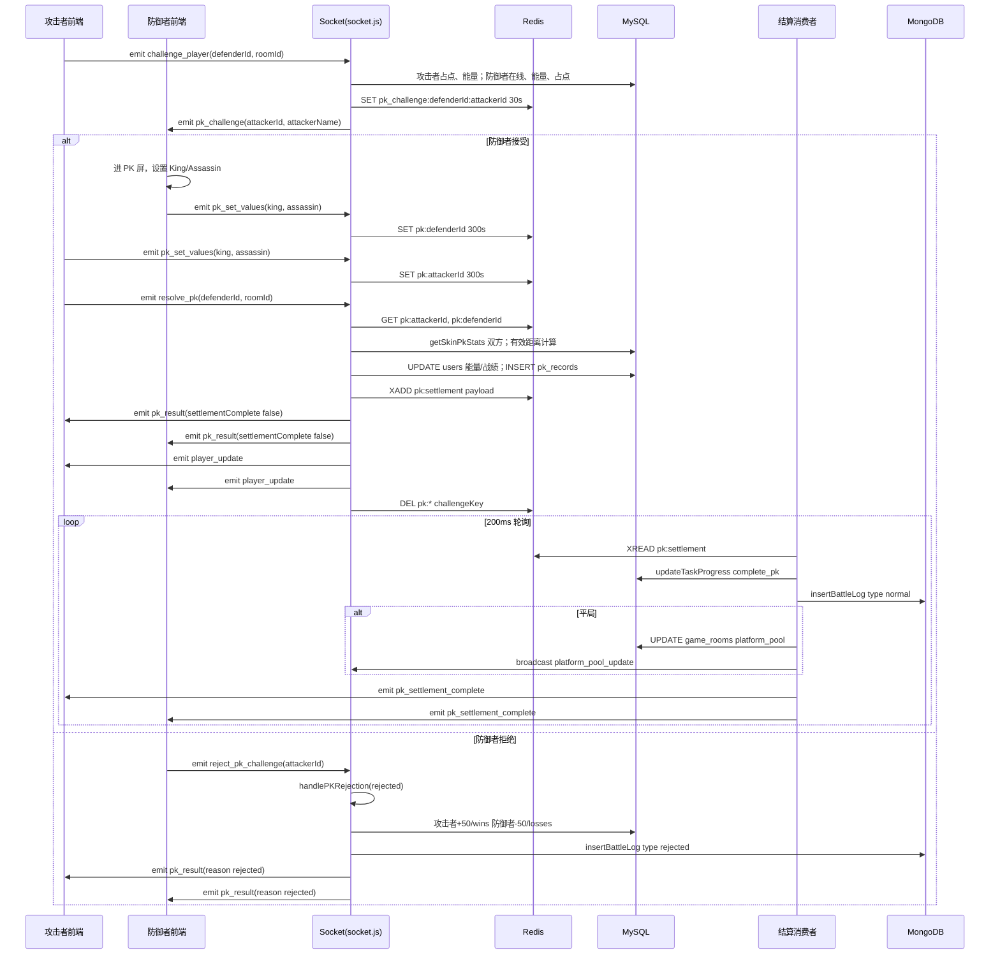
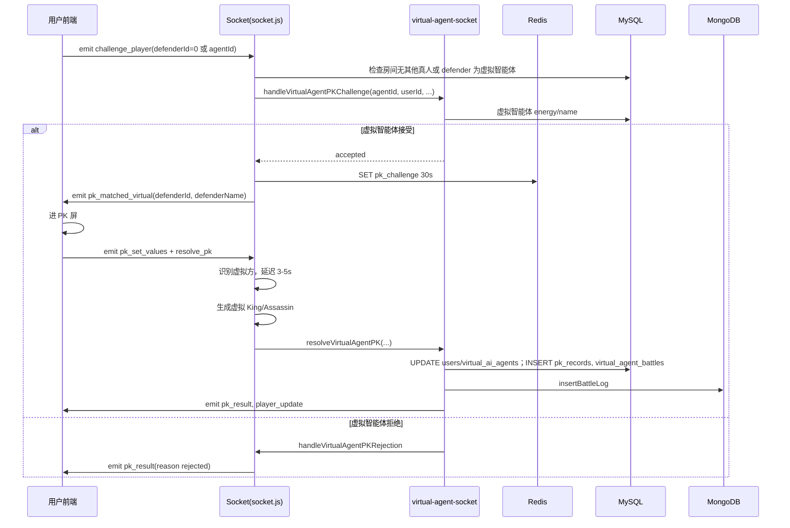
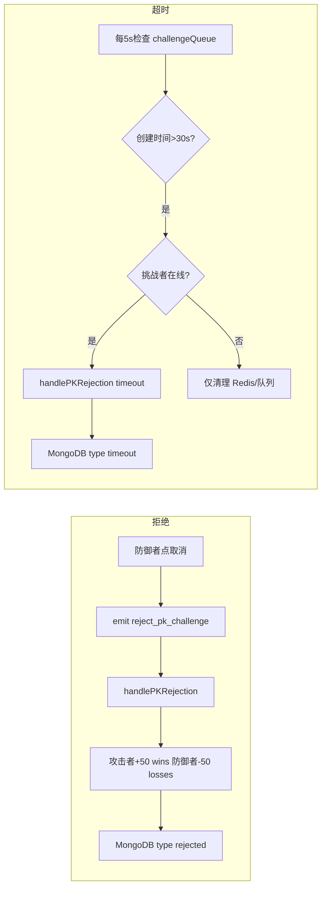
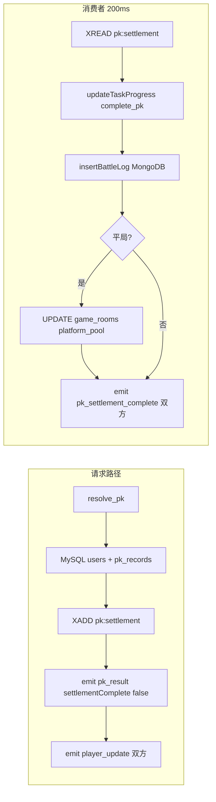

# PK 环节数据流与代码清单

本文档聚焦**协议对决（PK）**环节，梳理全链路数据流、业务规则与代码清单。整体架构与其余模块见 [DATA_FLOW_AND_BUSINESS_LOGIC.md](DATA_FLOW_AND_BUSINESS_LOGIC.md)；PK 规则与皮肤公式见 [GAME_LOGIC.md](GAME_LOGIC.md)；Socket 事件定义见 [SOCKET_PROTOCOL.md](SOCKET_PROTOCOL.md)；MongoDB 对战日志见 [MONGODB_BATTLE_LOGS.md](MONGODB_BATTLE_LOGS.md)。

---

## 目录

1. [PK 环节概述](#1-pk-环节概述)
2. [PK 数据流图](#2-pk-数据流图)
3. [PK 业务逻辑详解](#3-pk-业务逻辑详解)
4. [涉及的存储](#4-涉及的存储)
5. [代码清单](#5-代码清单)
6. [故障排查：防御者未实时收到 PK 邀请](#6-故障排查防御者未实时收到-pk-邀请)

---

## 1. PK 环节概述

### 1.1 入口与参与方

- **入口**：前端点击「能量溢出（协议对决）」→ `game.openPK()` → 选择目标或自动匹配 → 发送 `challenge_player`。
- **参与方**：攻击者（发起挑战）、防御者（被挑战）；防御者可为**真人用户**或**虚拟智能体**（`virtual_ai_agents`）。
- **结果形态**：正常 PK（双方设置 King/Assassin 后结算）、拒绝（防御者点取消）、超时（防御者 30 秒内未响应且挑战者仍在线）。

### 1.2 存储概览

| 存储 | 用途 |
|------|------|
| **MySQL** | 用户能量/战绩（users）、正常 PK 记录（pk_records）、虚拟智能体对战（virtual_agent_battles）、平台池（game_rooms）、配置（game_config）、皮肤（ai_agent_skins） |
| **Redis** | 挑战状态（30s TTL）、PK 数值（300s TTL）、结算流 `pk:settlement`（由消费者异步处理） |
| **MongoDB** | 全部对战详情（battle_logs：normal/rejected/timeout），供「对战记录」列表查询 |

---

## 2. PK 数据流图

### 2.1 真人 vs 真人 PK 流程

从发起挑战到双方收到 `pk_settlement_complete` 的完整时序。

### 2.2 真人 vs 虚拟智能体

用户挑战虚拟智能体或无真人时自动匹配虚拟智能体；虚拟方自动接受后发 `pk_matched_virtual`，用户设置数值后 `resolve_pk`，服务端延迟 3–5s 生成虚拟数值并结算（不经过 pk:settlement 流）。

### 2.3 拒绝与超时

### 2.4 结算流（真人 vs 真人正常 PK）

请求路径只负责 MySQL 更新与 XADD，其余由消费者统一处理，保证响应即时、数据一致。

---

## 3. PK 业务逻辑详解

### 3.1 发起条件

- **攻击者**：能量 ≥ 100、当前房间已占据节点（`getCanPK(userId, roomId, energy)`，见 [pk-challenge-helper.js](server/utils/pk-challenge-helper.js)）；不能挑战自己。
- **防御者（真人）**：在线、能量 ≥ 100、当前房间已占据节点；若防御者已在待响应挑战中（`isDefenderInPendingChallenge`），则直接判攻击者胜。
- **防御者（虚拟智能体）**：`virtual_ai_agents.status = 'online'` 且同房间；若已在待响应挑战中则同样判攻击者胜。**自动匹配**（无其他真人时 `defenderId: 0`）时，仅考虑「已占据节点（`current_node_id IS NOT NULL`）且能量≥100」的虚拟智能体，与真人防御者条件一致；若无满足条件的虚拟智能体，则提示「当前没有其他在线用户占据节点，请等待」。

**可挑战玩家列表 (players) 与 players_update**：服务端下发的 `players` 语义为「当前在该房间内且在该房间已占据节点」的真人（由 [socket.js](server/socket.js) 中 `getPlayersWithNodesInRoom(roomId)` 与 `sendGameState` 一致）。用户断开连接或节点占用变化（释放/占据）时，会向房间广播 `game_state`（`type: 'players_update'`, `players: [...]`），前端更新 `displayState.players` 后「发起对战」使用的即为最新可挑战列表。前端仅在服务端确认挑战成功（`system_message` 成功且含「挑战请求已发送」）或收到 `pk_matched_virtual` 后才进入 PK 参数界面；若服务端返回错误（如目标不在线、未占点），仅提示错误不切屏。

### 3.2 数值设置

- **King / Assassin**：1–100；双方在 `resolve_pk` 前通过 `pk_set_values` 设置，存 Redis `pk:${userId}`，TTL 300 秒。
- 拒绝/超时无需设置数值；真人 vs 虚拟智能体时，虚拟方在服务端延迟后随机生成。

### 3.3 胜负与皮肤

- **原始攻击距离**：己方 = `|己方 assassin − 对方 king|`，对方 = `|对方 assassin − 己方 king|`。
- **有效距离（方案 A）**：使用双方当前皮肤的 `pk_attack`、`pk_defense` 及配置 `pk_skin_defense_distance_threshold`（默认 30）：
  - 己方有效距离：己方原始距离 ≥ 己方 pk_attack 时扣减 pk_attack，否则不扣减。
  - 对方有效距离：对方原始距离 ≤ 阈值时加上己方 pk_defense，否则不加。
- **判定**：有效距离更小者胜；相等则平局。详见 [GAME_LOGIC.md](GAME_LOGIC.md) 第 3 节。

### 3.4 能量与平台池

- 数值来自 `game_config`：`pk_energy_reward`、`pk_energy_loss`、`pk_draw_energy_loss`（默认均为 50）、`platform_pool_bonus`（默认 100）。
- 胜：+50；败：-50；平：双方各 -50；拒绝/超时：攻击者 +50，防御者 -50。
- 平局时仅真人 vs 真人且经 `pk:settlement` 消费者时更新 `game_rooms.platform_pool` 并广播 `platform_pool_update`。

### 3.5 拒绝与超时

- **拒绝**：防御者点击取消 → `reject_pk_challenge` → `handlePKRejection(attackerId, defenderId, roomId, 'rejected')` 或虚拟方 `handleVirtualAgentPKRejection`；不写 `pk_records`，写 MongoDB `type: 'rejected'`。
- **超时**：每 5 秒检查 `challengeQueue`，若挑战创建超过 30 秒且**挑战者仍在线**，则执行与拒绝相同的判负逻辑，reason 为 `'timeout'`，并写 MongoDB `type: 'timeout'`；若挑战者已离线则仅清理 Redis 与队列。

### 3.6 虚拟智能体

- 用户可指定 `defenderId` 为虚拟智能体 ID，或无真人时传 `defenderId: 0` 自动匹配在线虚拟智能体。
- 虚拟智能体接受/拒绝由 [virtual-agent-socket.js](server/services/virtual-agent-socket.js) `handleVirtualAgentPKChallenge` 根据能量等计算；接受后发 `pk_matched_virtual`。
- 结算在 [virtual-agent-socket.js](server/services/virtual-agent-socket.js) `resolveVirtualAgentPK` 中完成：更新 `users` / `virtual_ai_agents`，写 `pk_records`（attacker_type/defender_type）、`virtual_agent_battles`、MongoDB，并推送 `pk_result`/`player_update`（不经过 `pk:settlement` 流）。

---

## 4. 涉及的存储

### 4.1 MySQL

| 表名 | 与 PK 相关的字段/用途 |
|------|------------------------|
| `users` | `energy`、`stamina`、`wins`、`losses`、`draws`、`current_skin_id`（皮肤攻防） |
| `pk_records` | 仅**正常 PK**；`attacker_id`、`defender_id`、`attacker_type`、`defender_type`、`attacker_king`、`attacker_assassin`、`defender_king`、`defender_assassin`、`result`、`energy_change`、`created_at` |
| `virtual_agent_battles` | 虚拟智能体参与的对战；攻击者/防御者 ID 与类型、双方 King/Assassin、result（含 rejected/timeout）、能量变化、room_id |
| `game_rooms` | `platform_pool`（平局时增加） |
| `game_config` | `pk_energy_reward`、`pk_energy_loss`、`pk_draw_energy_loss`、`platform_pool_bonus`、`pk_skin_defense_distance_threshold` |
| `game_nodes` | 占点校验（攻击者/防御者是否占据节点） |
| `ai_agent_skins` | `pk_attack`、`pk_defense`（通过 `users.current_skin_id` 关联） |

### 4.2 Redis

| Key/Stream | TTL/说明 |
|------------|----------|
| `pk_challenge:${defenderId}:${attackerId}` | 30 秒；挑战状态，用于超时检查与 resolve_pk 时识别攻防方 |
| `pk:${userId}` | 300 秒；当前用户的 King/Assassin |
| `pk:settlement` | Stream；结算 payload，由消费者 XREAD，执行任务进度、MongoDB、平台池后发送 `pk_settlement_complete` |

### 4.3 MongoDB

- **集合**：`battle_logs`（由 `MONGODB_DB` 配置，默认 `energy_mountain`）。
- **文档**：`type` 为 `'normal'`（正常 PK）、`'rejected'`（拒绝）、`'timeout'`（超时）；含双方 ID/名称、攻防数值（仅 normal）、攻击距离、结果、能量变化、roomId、createdAt。详见 [MONGODB_BATTLE_LOGS.md](MONGODB_BATTLE_LOGS.md)。

---

## 5. 代码清单

### 5.1 前端 [game.html](game.html)

| 位置（约） | 类型 | 说明 |
|-----------|------|------|
| 1085 | 按钮 | 「能量溢出」按钮，`game.openPK()` |
| 1122 | 按钮 | 「确认执行协议」，`game.resolveCombat()` |
| 4020 | 数据 | `pkData.pendingResult`（待 `pk_settlement_complete` 后展示） |
| 4225–4240 | 监听 | `pk_challenge`：确认则进 PK 屏，拒绝则 `emit('reject_pk_challenge', …)` |
| 4242–4250 | 监听 | `pk_matched_virtual`：设置 enemyId/enemyName，进 PK 屏 |
| 4253–4342 | 监听 | `pk_result`：拒绝/超时直接展示；正常 PK 存 pendingResult、显示结算中或直接 showResult |
| 4344–4352 | 监听 | `pk_settlement_complete`：若有 pendingResult 则 showPKResultAndFinalize，隐藏结算中 |
| 4496–4539 | 函数 | `game.openPK()`：canPK 校验、选敌或 defenderId:0、emit `challenge_player` |
| 4540–4553 | 函数 | `game.randomPKSet()`：随机 King/Assassin |
| 4556–4576 | 函数 | `game.resolveCombat()`：emit `pk_set_values` + `resolve_pk`，显示等待提示 |
| 4658–4680+ | 函数 | `showPKSettlementStatus`、`showPKResultAndFinalize` |

### 5.2 服务端 Socket [server/socket.js](server/socket.js)

| 位置（约） | 类型 | 说明 |
|-----------|------|------|
| 23–37 | 函数 | `getSkinPkStats(userId)`：当前皮肤 pk_attack、pk_defense |
| 187–293 | 函数 | `handlePKRejection(attackerId, defenderId, roomId, reason, options)`：拒绝/超时判负、更新 users、写 MongoDB、发 pk_result/player_update |
| 775–1106 | 事件 | `challenge_player`：校验攻击者占点与能量、防御者在线/能量/占点；真人/虚拟分支；写 Redis 挑战状态；发 pk_challenge 或 pk_matched_virtual |
| 1109–1116 | 事件 | `pk_set_values`：写 Redis `pk:${socket.userId}` TTL 300 |
| 1122–1158 | 事件 | `reject_pk_challenge`：校验后调 handlePKRejection |
| 1167–1508 | 事件 | `resolve_pk`：从 Redis 取双方数值；真人/虚拟分支；真人时有效距离计算、更新 users 与 pk_records、XADD pk:settlement、发 pk_result/player_update、清理 Redis |
| 1433–1436 | - | XADD `pk:settlement`、emit pk_result（settlementComplete: false） |
| 1548 | 调用 | `startPkSettlementConsumer()`（初始化时） |
| 1680–1719 | 定时 | 每 5s PK 超时检查（challengeQueue，30s，仅挑战者在线时判负） |
| 1912–1998 | 函数 | `PK_SETTLEMENT_STREAM`、`consumePkSettlement`、`startPkSettlementConsumer`（200ms 轮询：任务进度、MongoDB、平台池、pk_settlement_complete） |

### 5.3 虚拟智能体 PK [server/services/virtual-agent-socket.js](server/services/virtual-agent-socket.js)

| 位置（约） | 类型 | 说明 |
|-----------|------|------|
| 19–34 | 函数 | `getSkinPkStats`（与 socket.js 一致，虚拟智能体无皮肤则 0） |
| 86–219 | 函数 | `handleVirtualAgentPKChallenge`：接受/拒绝、自动设置数值或拒绝后判负 |
| 237–270 | - | 虚拟智能体主动挑战真人时，向真人发 `pk_challenge` |
| 427–438+ | - | INSERT `virtual_agent_battles`、`insertBattleLog` |
| 578–830+ | 函数 | `resolveVirtualAgentPK`：胜负计算、更新 users/virtual_ai_agents、写 pk_records、virtual_agent_battles、MongoDB、发 pk_result/player_update |
| 900–945 | - | 向双方 socket 发 pk_result |
| 971 | - | 清理 challengeKey |
| 988–989 | 导出 | `resolveVirtualAgentPK` |

### 5.4 辅助与路由

| 文件 | 说明 |
|------|------|
| [server/utils/pk-challenge-helper.js](server/utils/pk-challenge-helper.js) | `isParticipantInAnyChallenge`、`isDefenderInPendingChallenge`、`userHasNodeInRoom`、`getCanPK` |
| [server/routes/battles.js](server/routes/battles.js) | `GET /api/battles`：从 MongoDB battle_logs 分页查当前用户对战记录（含 normal/rejected/timeout） |
| [server/utils/redis.js](server/utils/redis.js) | `xAdd`、`xRead`（pk:settlement 流） |
| [server/utils/mongo.js](server/utils/mongo.js) | `getBattleLogsCollection`、`insertBattleLog` |

### 5.5 数据库与迁移

| 文件/存储 | 说明 |
|-----------|------|
| [database/init_env.sql](database/init_env.sql) | `pk_records` 基础表结构 |
| [database/migrations/extend_pk_records_for_virtual_agents.sql](database/migrations/extend_pk_records_for_virtual_agents.sql) | `pk_records` 增加 attacker_type、defender_type 及索引 |
| [database/migrations/add_virtual_ai_agents.sql](database/migrations/add_virtual_ai_agents.sql) | `virtual_ai_agents`、`virtual_agent_battles` 表 |
| [database/migrations/add_pk_skin_defense_distance_threshold.sql](database/migrations/add_pk_skin_defense_distance_threshold.sql) | `game_config` 中 pk_skin_defense_distance_threshold |
| [database/migrations/add_ai_agent_skins.sql](database/migrations/add_ai_agent_skins.sql) | 皮肤表含 pk_attack、pk_defense |

---

## 6. 故障排查：防御者未实时收到 PK 邀请

根据当前数据流与代码，攻击者发起 PK 后防御者没有实时收到 `pk_challenge` 邀请，可能由以下原因导致。

### 6.1 原因一：defenderId 类型不一致导致查不到 Socket（高概率）

**现象**：攻击者点挑战后收到系统提示「目标玩家不在线」，而防御者确实在线且在房间内。

**数据流**：

1. 前端 [game.html](game.html) 从 `displayState.players` 取 `target.id`，通过 `challenge_player` 发送 `defenderId: target.id`。
2. `players` 来自服务端 [socket.js](server/socket.js) `sendGameState` 中从 MySQL 查出的 `users[0].id`，不同驱动/序列化下可能是 **number** 或 **string**。
3. 服务端在 `challenge_player` 中仅用 `connectedUsers.get(defenderId)` 查找防御者 socket（[socket.js 约 1017 行](server/socket.js)）。
4. `connectedUsers` 的 key 在连接时被统一为 **number**（[socket.js 约 405–406 行](server/socket.js)：`socket.userId = ... Number(uid)`）。
5. 若 `defenderId` 为字符串（如 `"123"`），则 `Map.get("123")` 与 key `123` 不相等，返回 `undefined`，逻辑判为「目标玩家不在线」，**不会向防御者 emit `pk_challenge`**。

**对比**：在 `resolve_pk` 与 `consumePkSettlement` 中，已有兼容写法：

- `connectedUsers.get(actualAttackerId) || connectedUsers.get(Number(actualAttackerId))`
- `connectedUsers.get(actualDefenderId) || connectedUsers.get(Number(actualDefenderId))`

而 `challenge_player` 和 `handlePKRejection` 中未对 `defenderId`/`attackerId` 做相同兼容。

**建议修复**（保持与现有 resolve_pk 一致）：

- 在 `challenge_player` 中取防御者 socket 时使用：  
  `const defenderSocketId = connectedUsers.get(defenderId) || connectedUsers.get(Number(defenderId));`
- 在 `handlePKRejection` 中取攻击者/防御者 socket 时同样对 `attackerId`、`defenderId` 做 number 兼容查找（如 `connectedUsers.get(id) || connectedUsers.get(Number(id))`）。

### 6.2 原因二：防御者多标签/多连接只保留一个 Socket（中概率）

**现象**：防御者开了多个浏览器标签（同一账号），只有其中一个标签会收到 PK 邀请，当前正在看的标签可能收不到。

**数据流**：

1. 每个标签一个 WebSocket 连接，对应一个 `socket.id`。
2. 服务端用 **单 Map** `connectedUsers: userId → socketId`，在 `connection` 时执行 `connectedUsers.set(socket.userId, socket.id)`（[socket.js 约 417 行](server/socket.js)）。
3. 同一用户第二次连接（另一标签）会**覆盖**第一次的 socketId，因此 Map 中只保留**最后一次连接**的 socketId。
4. 发送 `pk_challenge` 时使用 `io.to(defenderSocketId).emit(...)`，仅发往该唯一 socketId。
5. 若防御者正在看的标签是「先连接、后被覆盖」的那个，则该标签对应的 socket 已不在 Map 中，**收不到邀请**。

**建议**（可选增强）：

- 将 `connectedUsers` 改为「userId → Set\<socketId\>」或数组，同一用户多连接时向该用户所有 socket 广播 `pk_challenge`，这样任意标签都能收到。
- 若保留单 socket 设计，需在业务上明确「以最近一次连接为准」，并在前端提示用户避免多开同一账号多标签。

### 6.3 原因三：防御者未加入房间或断线未重连（低概率）

**数据流**：

1. 攻击者可见的玩家列表来自 `sendGameState` 中当前房间成员（`io.sockets.adapter.rooms.get(\`room_${roomId}\`)`），只有 **emit 过 `join_game`** 的 socket 才会进入该房间。
2. 若防御者连接后从未发送 `join_game`（例如前端未自动调用或异常），则不会出现在 `players` 中，攻击者一般选不到该防御者；若因缓存或异常仍选到，则其 socket 可能未在房间内，但 **connectedUsers 仍会在 connection 时写入**，故仍能通过 socketId 发到该连接。
3. 若防御者已断线且未重连，则 `disconnect` 时已执行 `connectedUsers.delete(socket.userId)`，`connectedUsers.get(defenderId)` 为 `undefined`，攻击者会收到「目标玩家不在线」。  
因此「未加入房间」或「断线」通常表现为攻击者端提示目标不在线，而不是防御者在线却收不到。

**建议**：确保前端在连接成功后自动 emit `join_game`（含重连后再次 join），并保证攻击者列表来自服务端最新 `game_state`，避免使用过期列表。

### 6.4 小结与排查顺序

| 优先级 | 可能原因 | 攻击者侧表现 | 建议排查/修复 |
|--------|----------|--------------|----------------|
| 高 | defenderId 为 string，Map 查不到 | 「目标玩家不在线」 | 对 defenderId/attackerId 做 Number 兼容查找（见 6.1） |
| 中 | 防御者多标签，邀请只发到最后一连 | 仅部分标签收不到 | 改为按 userId 多 socket 广播或限制多标签（见 6.2） |
| 低 | 防御者未 join_game 或已断线 | 「目标玩家不在线」或列表无此人 | 检查 join_game 与重连逻辑（见 6.3） |

实现 6.1 的兼容查找后，再观察防御者是否仍收不到邀请；若仍有问题，可再按 6.2、6.3 排查或增强。

### 6.5 仅 1 人在线占点仍能匹配到对手

**现象**：房间内只有 1 个真人占据节点、无其他在线用户占点，点击发起 PK 仍进入 PK 界面并提示「提交参数等待对方」，未提示「当前没有其他在线用户，请等待」。

**原因**：自动匹配虚拟智能体时此前未校验「已占据节点」与「能量≥100」，只要房间内有任意在线虚拟智能体就会被匹配。

**修复**：在 `challenge_player` 的自动匹配查询中增加 `current_node_id IS NOT NULL AND energy >= 100`，与真人防御者条件一致；无满足条件的虚拟智能体时返回「当前没有其他在线用户占据节点，请等待」。参见上文 3.1 节自动匹配说明。

---

## 参考文档

- [DATA_FLOW_AND_BUSINESS_LOGIC.md](DATA_FLOW_AND_BUSINESS_LOGIC.md) — 系统架构、2.4 PK 对战流程、3.2.3 PK 对战、整体代码清单
- [GAME_LOGIC.md](GAME_LOGIC.md) — 第 3 节 PK 规则、皮肤攻防公式、能量与平台池
- [SOCKET_PROTOCOL.md](SOCKET_PROTOCOL.md) — PK 相关 C->S / S->C 事件与参数
- [MONGODB_BATTLE_LOGS.md](MONGODB_BATTLE_LOGS.md) — battle_logs 集合与字段说明
