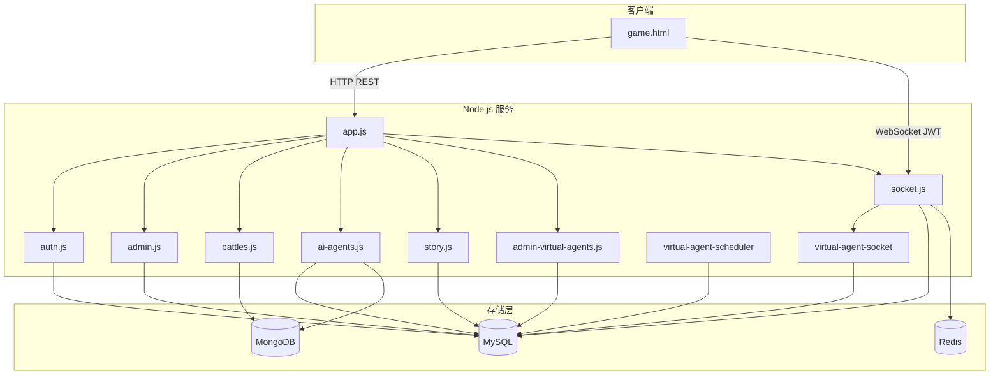
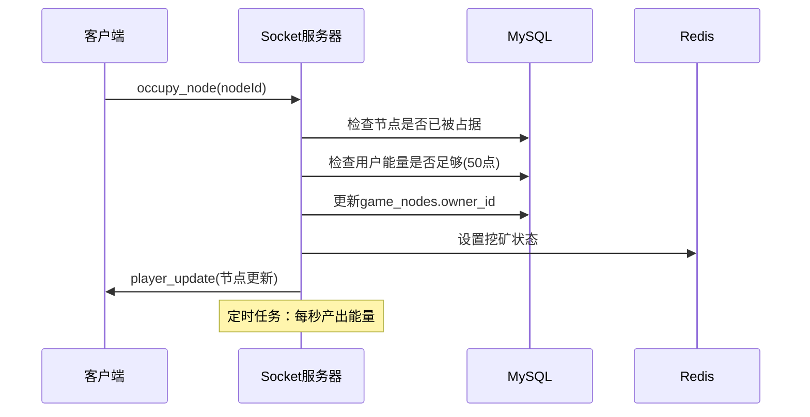
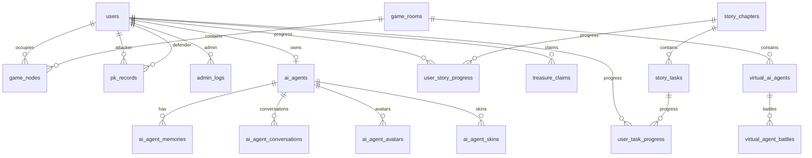
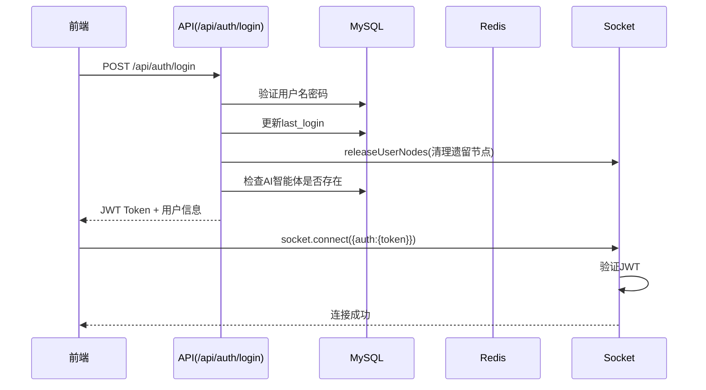
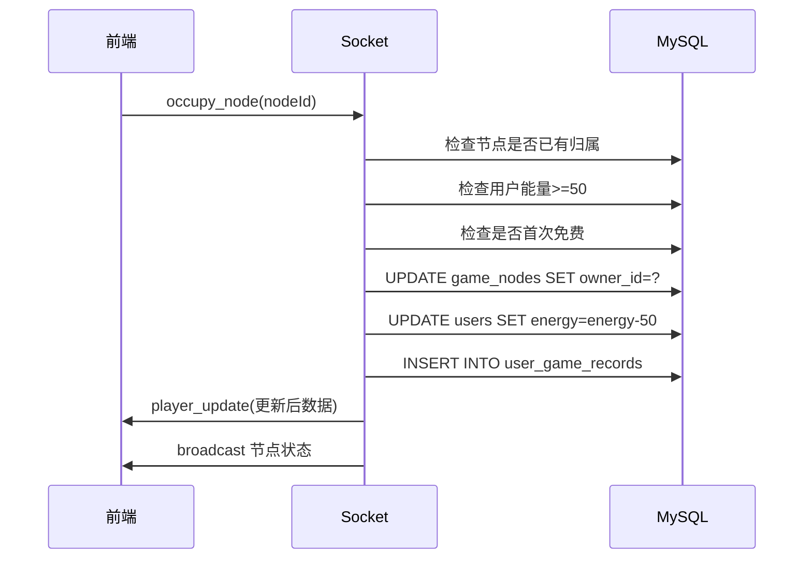
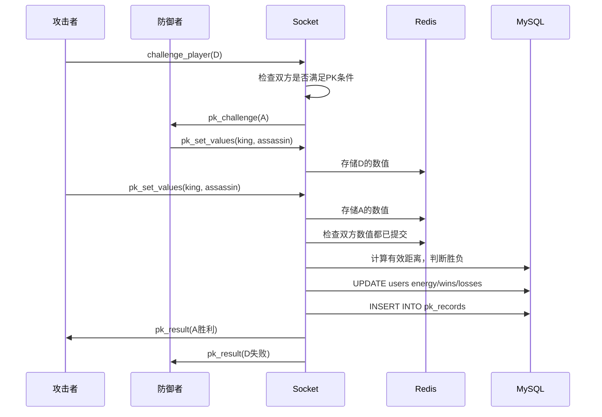
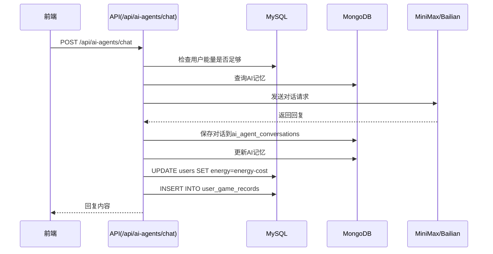

# 能量山 - 项目经验文档

> 基于最新数据库 `aibot_2026-02-25_02-50-58_mysql_data_QG1cl.sql` 分析
> 最后更新：2026-02-27
> **修改版本：v1.4**

---

## 1. 项目概述与定位

### 1.1 项目基本信息

| 属性 | 值 |
|------|-----|
| 项目名称 | 能量山（零号协议 / PROJECT: ZERO） |
| 类型 | PK实时联网多人在线游戏（网页端） |
| 技术栈 | Node.js + Express + Socket.io |
| 前端 | 单一HTML文件（game.html）+ Socket.io客户端 |
| 认证方式 | JWT |
| 数据库 | MySQL + Redis + MongoDB |

### 1.2 核心玩法

1. **节点占据与挖矿**：玩家占据地图节点，每秒产出能量
2. **玩家PK对战**：设置King/Assassin数值，通过策略预判对手位置进行对战
3. **能量宝藏**：探索地图发现宝藏节点，领取额外能量奖励
4. **AI智能体对话**：与AI智能体对话，生成图片/视频/语音
5. **剧情任务系统**：完成章节任务获得能量和体力奖励
6. **虚拟智能体**：AI控制的游戏角色，可自动与玩家PK

---

## 2. 系统架构图

### 2.1 整体架构



### 2.2 数据存储分层

| 存储类型 | 存储内容 | 说明 |
|---------|---------|------|
| **MySQL** | 用户、房间、节点、配置、剧情任务、AI智能体元数据 | 权威数据源，持久化存储 |
| **Redis** | 验证码、PK数值(king/assassin)、挖矿状态、节点占用缓存 | 临时数据与缓存 |
| **MongoDB** | 对战详细日志、AI工作台会话与对话历史、AI智能体记忆 | 大文档与历史数据 |

---

## 3. 核心功能模块详解

### 3.1 用户系统

**文件**：`server/routes/auth.js`

| 功能 | API | 说明 |
|------|-----|------|
| 获取验证码 | `GET /api/auth/captcha` | 图形验证码，防止暴力注册 |
| 用户注册 | `POST /api/auth/register` | 用户名+密码+验证码，首次注册能量为0 |
| 用户登录 | `POST /api/auth/login` | 验证密码，发放JWT Token |
| 获取当前用户 | `GET /api/auth/me` | 返回用户信息、能量、体力、胜败记录 |
| 兑换激活码 | `POST /api/auth/redeem-game-code` | 兑换能量或体力 |
| 生成能量码 | `POST /api/auth/generate-energy-code` | 用户消耗自身能量生成可赠与的激活码 |
| 用户登出 | `POST /api/auth/logout` | 释放占据的节点、清理PK挑战 |

**关键逻辑**：
- 注册时从 `game_config.initial_stamina` 读取初始体力
- 登录时清理遗留的节点占据（防止异常断开）
- 新注册用户需要初始化AI智能体（`needsAgentInitialization: true`）

### 3.2 游戏系统

**文件**：`server/socket.js`

#### 3.2.1 节点占据与挖矿



**关键配置**（game_config）：
- `energy_per_second`：每秒能量产出（默认10）
- `occupy_node_energy_cost`：占据节点消耗能量（默认50）
- `max_energy`：最大能量值（默认100）

#### 3.2.2 PK对战

**核心规则**：
- 双方设置King(1-100)和Assassin(1-100)数值
- 有效距离计算：`|100 - King - Assassin| ± 皮肤攻防修正`
- 距离小者获胜，距离相等为平局

**Socket事件**：
| 事件 | 方向 | 说明 |
|------|------|------|
| `challenge_player` | C→S | 发起PK挑战 |
| `pk_challenge` | S→C | 收到PK挑战通知 |
| `pk_set_values` | C→S | 提交King/Assassin数值 |
| `reject_pk_challenge` | C→S | 拒绝PK挑战 |
| `resolve_pk` | C→S | 确认PK结果 |
| `pk_result` | S→C | PK结果通知 |

**能量变化**：
- 胜利：+50能量（可超过100）
- 失败：-50能量（最低0）
- 平局：-50能量
- 拒绝/超时：挑战方获胜，被挑战方失败

#### 3.2.3 能量宝藏

- 宝藏节点存储在 `game_config.energy_treasure`（JSON数组）
- 每个节点只能被领取一次（treasure_claims表唯一约束）
- 领取后从配置中移除

### 3.3 AI智能体系统

**文件**：`server/routes/ai-agents.js`

| 功能 | API | 说明 |
|------|-----|------|
| 初始化智能体 | `POST /api/ai-agents/initialize` | 首次登录时设置名称 |
| 文本对话 | `POST /api/ai-agents/chat` | 与AI对话，消耗能量 |
| 生成图片 | `POST /api/ai-agents/image` | T2I/I2I生成 |
| 生成视频 | `POST /api/ai-agents/video` | 文生视频 |
| 语音合成 | `POST /api/ai-agents/voice` | 文字转语音 |
| 记忆管理 | `GET/PUT /api/ai-agents/memory` | 短期/中期/长期记忆 |
| 设定修改 | `PUT /api/ai-agents/setting` | 角色设定与形象 |

**AI提供商配置**：
- 通过 `game_config.ai_provider` 切换（minimax/bailian）
- 各功能开关：`ai_agent_image_enabled`、`ai_agent_video_enabled`、`ai_agent_voice_enabled`
- 能量消耗：`ai_agent_energy_cost`、`ai_agent_image_energy_cost`

**记忆类型**：
- short：短期会话记忆
- medium：中期跨会话记忆
- long：长期持久记忆

### 3.4 剧情任务系统

**文件**：`server/routes/story.js`、`server/socket.js`

**数据库表**：
- `story_chapters`：剧情章节
- `story_tasks`：任务线索
- `user_story_progress`：用户章节进度
- `user_task_progress`：用户任务进度

**当前剧情章节**：
1. **接入协议**（chapter_number=0）：首次占据节点
2. **节点拓荒**（chapter_number=1）：占据3节点、挖矿50点、发现宝藏
3. **过载与释放**（chapter_number=2）：能量达100、首次PK

**任务类型**：
- `occupy_node`：占据节点
- `mine_energy`：挖掘能量
- `find_treasure`：发现宝藏
- `reach_energy`：能量达标
- `complete_pk`：完成PK
- `chat_with_ai`：AI对话

### 3.5 虚拟智能体系统

**文件**：
- `server/routes/admin-virtual-agents.js`（管理API）
- `server/services/virtual-agent-scheduler.js`（调度器）
- `server/services/virtual-agent-socket.js`（Socket处理）

**功能**：
- 虚拟AI角色自动占据节点和挖矿
- 定时向玩家发起PK挑战
- 调度器控制行为频率和概率

### 3.6 管理员后台

**文件**：`server/routes/admin.js`

| 功能 | API | 说明 |
|------|-----|------|
| 获取客户端配置 | `GET /api/admin/client-config` | 公开接口，游戏加载配置 |
| 用户列表 | `GET /api/admin/users` | 分页+搜索+状态筛选 |
| 封禁用户 | `PUT /api/admin/users/:id/ban` | 禁用账户 |
| 解封用户 | `PUT /api/admin/users/:id/unban` | 恢复账户 |
| 修改用户数据 | `PUT /api/admin/users/:id/stats` | 修改能量/体力/胜败记录 |
| 游戏配置 | `GET/PUT /api/admin/config` | 游戏参数配置 |
| 激活码管理 | `POST /api/admin/game-codes` | 生成激活码 |
| 生成Auth码 | `POST /api/admin/generate-auth-code` | 批量生成兑换码 |

**管理员权限**：`users.is_admin = 1`

### 3.7 皮肤系统

**文件**：`server/routes/admin-ai-skins.js`

- 皮肤带有PK攻防属性（pk_attack/pk_defense）
- 影响有效距离计算
- 可通过商城兑换或激活码获得
- 用户拥有皮肤记录：`user_ai_agent_skins`

---

## 4. API接口速查表

### 4.1 认证接口（/api/auth）

| 方法 | 路径 | 认证 | 说明 |
|------|------|------|------|
| GET | /captcha | 否 | 获取图形验证码 |
| POST | /register | 否 | 用户注册 |
| POST | /login | 否 | 用户登录 |
| POST | /logout | 是 | 用户登出 |
| GET | /me | 是 | 获取当前用户信息 |
| POST | /redeem-game-code | 是 | 兑换激活码 |
| POST | /generate-energy-code | 是 | 生成能量棒激活码 |
| GET | /my-energy-codes | 是 | 获取自己生成的激活码 |

### 4.2 管理接口（/api/admin）

| 方法 | 路径 | 认证 | 说明 |
|------|------|------|------|
| GET | /client-config | 否 | 获取客户端配置 |
| GET | /users | 是(管理员) | 用户列表 |
| PUT | /users/:id/ban | 是(管理员) | 封禁用户 |
| PUT | /users/:id/unban | 是(管理员) | 解封用户 |
| DELETE | /users/:id | 是(管理员) | 删除用户 |
| PUT | /users/:id/stats | 是(管理员) | 修改用户数据 |
| GET | /config | 是(管理员) | 获取配置 |
| PUT | /config | 是(管理员) | 修改配置 |
| GET | /stats | 是(管理员) | 统计数据 |
| GET | /logs | 是(管理员) | 操作日志 |
| POST | /game-codes | 是(管理员) | 生成激活码 |
| GET | /game-codes | 是(管理员) | 激活码列表 |
| POST | /generate-auth-code | 是(管理员) | 批量生成 |

### 4.3 游戏接口（/api/battles）

| 方法 | 路径 | 认证 | 说明 |
|------|------|------|------|
| GET | / | 是 | 获取对战记录（MongoDB） |

### 4.4 AI智能体接口（/api/ai-agents）

| 方法 | 路径 | 认证 | 说明 |
|------|------|------|------|
| POST | /initialize | 是 | 初始化AI智能体 |
| GET | / | 是 | 获取AI智能体信息 |
| PUT | /setting | 是 | 修改设定 |
| POST | /chat | 是 | 文本对话 |
| POST | /image | 是 | 生成图片 |
| POST | /video | 是 | 生成视频 |
| POST | /voice | 是 | 语音合成 |
| GET | /memory | 是 | 获取记忆 |
| PUT | /memory | 是 | 修改记忆 |
| GET | /knowledge | 是 | 获取知识库 |
| POST | /knowledge | 是 | 添加知识 |
| DELETE | /knowledge/:id | 是 | 删除知识 |

### 4.5 AI分身客服接口（/api/agent-chat）

| 方法 | 路径 | 认证 | 说明 |
|------|------|------|------|
| GET | /verify/:avatar_id | 否 | 验证链接，获取分身信息 |
| POST | /create-session | 否 | 创建匿名会话 |
| POST | /message | 否 | 发送消息（AI回复） |
| GET | /history | 否 | 获取会话历史 |

### 4.6 分身客服后台接口（/api/agent-chat-admin）

| 方法 | 路径 | 认证 | 说明 |
|------|------|------|------|
| GET | /avatars | 是 | 获取会员所有分身列表 |
| GET | /rooms | 是 | 获取所有活跃会话 |
| GET | /room/:sessionId | 是 | 获取会话详情 |
| POST | /join/:sessionId | 是 | 人工接入会话 |
| POST | /leave/:sessionId | 是 | 人工离开会话 |
| POST | /switch-mode/:sessionId | 是 | 切换AI/人工模式 |
| POST | /send/:sessionId | 是 | 人工发送消息 |
| POST | /close/:sessionId | 是 | 关闭会话 |
| POST | /request-human/:sessionId | 否 | 用户请求人工接入 |

### 4.7 剧情接口（/api/story）

| 方法 | 路径 | 认证 | 说明 |
|------|------|------|------|
| GET | /chapters | 是 | 章节列表 |
| GET | /chapters/:id | 是 | 章节详情 |
| GET | /progress | 是 | 用户进度 |
| POST | /tasks/:id/complete | 是 | 完成任务 |
| PUT | /chapters/:id/complete | 是 | 完成章节 |

### 4.6 虚拟智能体接口（/api/admin/virtual-agents）

| 方法 | 路径 | 认证 | 说明 |
|------|------|------|------|
| GET | / | 是(管理员) | 列表 |
| POST | / | 是(管理员) | 创建 |
| PUT | /:id | 是(管理员) | 更新 |
| DELETE | /:id | 是(管理员) | 删除 |
| PUT | /:id/status | 是(管理员) | 上下线 |

### 4.7 皮肤接口（/api/admin/ai-skins）

| 方法 | 路径 | 认证 | 说明 |
|------|------|------|------|
| GET | / | 是(管理员) | 皮肤列表 |
| POST | / | 是(管理员) | 创建皮肤 |
| PUT | /:id | 是(管理员) | 更新皮肤 |
| DELETE | /:id | 是(管理员) | 删除皮肤 |
| GET | /user/:userId | 是 | 用户皮肤 |

---

## 5. Socket事件速查表

### 5.1 客户端→服务端

| 事件 | 参数 | 说明 |
|------|------|------|
| `join_game` | roomId | 加入游戏房间 |
| `leave_game` | - | 离开游戏房间 |
| `occupy_node` | nodeId | 占据节点 |
| `release_node` | nodeId | 释放节点 |
| `start_mining` | - | 开始挖矿 |
| `stop_mining` | - | 停止挖矿 |
| `challenge_player` | defenderId | 发起PK挑战 |
| `pk_set_values` | king, assassin | 设置PK数值 |
| `reject_pk_challenge` | attackerId | 拒绝PK |
| `resolve_pk` | - | 确认PK结果 |

### 5.2 服务端→客户端

| 事件 | 参数 | 说明 |
|------|------|------|
| `game_state` | 房间状态 | 游戏状态同步 |
| `player_update` | 更新数据 | 玩家数据更新 |
| `node_update` | 节点数据 | 节点状态变化 |
| `pk_challenge` | 挑战者信息 | 收到PK挑战 |
| `pk_matched_virtual` | 虚拟智能体 | 匹配到虚拟对手 |
| `pk_result` | 结果数据 | PK结果 |
| `treasure_claimed` | 领取信息 | 宝藏被领取 |
| `treasure_node_revealed` | 节点ID | 宝藏节点暴露 |
| `task_progress_ready` | 任务信息 | 任务进度达标 |
| `system_message` | 消息内容 | 系统消息 |

---

## 6. 数据库表关系图

### 6.1 ER图



### 6.2 表清单（18张核心表）

| 分类 | 表名 | 说明 |
|------|------|------|
| **用户** | users | 用户账户信息 |
| **游戏** | game_rooms | 游戏房间 |
| **游戏** | game_nodes | 地图节点（100个） |
| **游戏** | pk_records | PK对战记录 |
| **游戏** | treasure_claims | 宝藏领取记录 |
| **游戏** | game_activation_codes | 激活码 |
| **配置** | game_config | 游戏配置参数 |
| **剧情** | story_chapters | 剧情章节 |
| **剧情** | story_tasks | 任务线索 |
| **剧情** | user_story_progress | 用户章节进度 |
| **剧情** | user_task_progress | 用户任务进度 |
| **AI** | ai_agents | AI智能体元数据 |
| **AI** | ai_agent_memories | AI记忆 |
| **AI** | ai_agent_conversations | AI对话记录 |
| **AI** | ai_agent_avatars | AI形象模板 |
| **AI** | ai_agent_skins | AI皮肤 |
| **AI** | user_ai_agent_skins | 用户拥有的皮肤 |
| **虚拟** | virtual_ai_agents | 虚拟智能体 |
| **虚拟** | virtual_agent_battles | 虚拟智能体对战记录 |
| **日志** | admin_logs | 管理员操作日志 |

### 6.3 关键字段说明

**users表核心字段**：
- `energy`：当前能量（0-100，PK胜利可超100）
- `stamina`：当前体力（0-100）
- `total_energy`：累计获得能量
- `wins/losses/draws`：PK胜败平次数
- `is_admin`：是否管理员
- `has_used_first_free_occupy`：是否已使用首次免费占据

**game_nodes表**：
- `node_id`：节点编号（1-100）
- `owner_id`：占据者ID
- `energy_production`：每秒能量产出

**pk_records表**：
- `attacker_type`/`defender_type`：user/virtual_agent

---

## 7. 关键配置项说明

### 7.1 游戏核心配置

| 配置键 | 默认值 | 说明 |
|--------|--------|------|
| energy_per_second | 10 | 每秒能量产出 |
| max_energy | 100 | 最大能量值 |
| max_stamina | 100 | 最大体力值 |
| pk_energy_reward | 50 | PK胜利奖励 |
| pk_energy_loss | 50 | PK失败损失 |
| occupy_node_energy_cost | 50 | 占据节点消耗 |
| platform_pool_bonus | 100 | 平局平台池增加 |
| energy_treasure | JSON数组 | 宝藏节点配置 |

### 7.2 AI功能配置

| 配置键 | 说明 |
|--------|------|
| ai_provider | AI提供商(minimax/bailian) |
| ai_agent_energy_cost | 对话能量消耗 |
| ai_agent_image_energy_cost | 图片生成消耗 |
| ai_agent_image_enabled | 图片功能开关 |
| ai_agent_video_enabled | 视频功能开关 |
| ai_agent_voice_enabled | 语音功能开关 |
| ai_agent_web_search_enabled | 联网搜索开关 |
| minimax_api_key | MiniMax API密钥 |
| minimax_api_url | MiniMax API地址 |

### 7.3 客户端配置

| 配置键 | 说明 |
|--------|------|
| client_api_base | API基础地址 |
| client_socket_url | Socket服务器地址 |
| game_rules_pk_min_value | PK数值最小值 |
| game_rules_pk_max_value | PK数值最大值 |

---

## 8. 数据流图

### 8.1 用户登录流程



### 8.2 节点占据流程



### 8.3 PK对战流程



### 8.4 AI对话流程



---

## 9. 开发注意事项

### 9.1 数据库操作

1. **事务处理**：能量扣减等操作需使用 `db.transaction()`
2. **数值安全**：从数据库读取数值后必须进行类型转换和范围校验
3. **UTF-8编码**：AI对话内容需使用 `cleanTextForDB()` 清理
4. **MongoDB降级**：AI对话历史优先查MongoDB，失败可回退

### 9.2 Socket编程

1. **服务端权威**：所有游戏逻辑在服务端计算，客户端只做展示
2. **JWT验证**：Socket连接时必须验证Token和用户状态
3. **状态同步**：使用 `game_state` 事件定期同步房间状态
4. **异常处理**：登出时必须释放节点和清理PK挑战

### 9.3 性能优化

1. **Redis缓存**：PK数值、挖矿状态使用Redis存储
2. **连接池**：MySQL连接池已配置，注意复用
3. **分页查询**：列表接口必须支持分页（page/limit）
4. **索引**：确保常用查询字段已建索引

### 9.4 安全考虑

1. **验证码**：注册/登录必须验证码，防止暴力破解
2. **速率限制**：使用 `express-rate-limit` 限制请求频率
3. **Token过期**：JWT设置合理过期时间
4. **管理员权限**：敏感操作必须检查 `is_admin`

### 9.5 常见问题

1. **节点占据失败**：检查能量是否足够、节点是否已被占用
2. **PK匹配失败**：检查双方是否都已占据节点、能量是否足够
3. **AI对话失败**：检查API配置、能量是否足够、网络是否正常
4. **激活码兑换失败**：检查激活码是否存在、是否已被使用

---

## 10. AI分身客服系统

### 10.1 功能概述

AI分身客服系统允许会员创建自定义AI分身，并将其部署为公开客服入口。用户可以通过链接访问AI客服，无需登录即可对话。会员可以在后台监控会话并人工介入。

### 10.2 核心功能

1. **分身管理**：创建、配置、删除AI分身
2. **公开客服**：生成分身客服链接，用户免登录对话
3. **知识库**：为分身配置知识库和记忆
4. **人工介入**：会员可实时接入会话，切换AI/人工模式

### 10.3 模式说明

| 模式 | 说明 |
|------|------|
| AI模式 | 用户消息由AI自动回复 |
| 人工模式 | 人工客服直接回复用户消息 |

### 10.4 MongoDB会话扩展字段

会话记录新增以下字段支持人工介入：

| 字段 | 类型 | 说明 |
|------|------|------|
| mode | string | 当前模式：'ai' 或 'human' |
| humanOperatorId | number | 人工客服ID |
| humanJoinedAt | datetime | 人工加入时间 |
| pendingHuman | boolean | 是否等待人工接入 |
| status | string | 会话状态：'active' 或 'closed' |

### 10.5 访问入口

| 页面 | 路径 | 说明 |
|------|------|------|
| 客服聊天 | `/agent/chat/:avatar_id?token=xxx` | 用户访问的客服页面 |
| 客服后台 | `/agent/admin` | 会员管理的后台页面 |

---

## 11. 文件结构

```
aibot/
├── server/
│   ├── app.js                 # Express主入口
│   ├── socket.js              # Socket.io核心
│   ├── config/
│   │   └── database.js        # 数据库配置
│   ├── routes/
│   │   ├── auth.js            # 认证
│   │   ├── admin.js           # 管理后台
│   │   ├── battles.js        # 对战记录
│   │   ├── ai-agents.js      # AI智能体
│   │   ├── story.js          # 剧情系统
│   │   ├── agent-avatars.js  # AI形象
│   │   ├── agent-knowledge.js # 知识库
│   │   ├── agent-chat.js     # 客服聊天
│   │   ├── agent-chat-admin.js # 分身客服后台
│   │   ├── admin-virtual-agents.js
│   │   ├── admin-ai-skins.js
│   │   └── admin-game-codes.js
│   ├── services/
│   │   ├── message-queue.js
│   │   ├── virtual-agent-scheduler.js
│   │   └── virtual-agent-socket.js
│   ├── middleware/
│   │   └── auth.js           # JWT认证
│   └── utils/
│       ├── db.js             # MySQL封装
│       ├── redis.js          # Redis封装
│       ├── mongo.js          # MongoDB封装
│       ├── minimax.js        # MiniMax API
│       ├── bailian.js        # 百川API
│       ├── memory-manager.js # 记忆管理
│       ├── captcha.js        # 验证码
│       ├── pk-challenge-helper.js
│       └── config-validator.js
├── game.html                  # 游戏主页面
├── admin.html                 # 管理员后台
├── index.html                 # 入口页面
├── agent-chat.html            # AI客服聊天页面（用户访问）
├── agent-chat-admin.html      # 分身客服后台（会员管理）
├── knowledge-manage.html      # 知识库管理页面
├── aiwork.html                # AI工作室页面
├── docs/                      # 文档
│   ├── ARCHITECTURE.md       # 架构设计
│   ├── DATABASE.md           # 数据模型
│   ├── API.md                # 接口文档
│   ├── SOCKET_PROTOCOL.md    # Socket协议
│   ├── GAME_LOGIC.md         # 游戏逻辑
│   └── ...
└── database/
    ├── init_env.sql          # 初始化脚本
    └── migrations/           # 增量脚本
```

---

## 11. 经验总结

### 11.1 项目亮点

1. **多存储组合**：MySQL+Redis+MongoDB各司其职
2. **实时通信**：Socket.io实现低延迟游戏交互
3. **服务端权威**：避免客户端作弊
4. **AI集成**：多模态AI能力（对话/图片/视频/语音）
5. **任务系统**：剧情驱动新手引导

### 11.2 可改进点

1. **水平扩展**：当前单进程，多实例需Redis Adapter
2. **缓存策略**：可增加热点数据缓存
3. **监控告警**：缺少运行监控
4. **日志系统**：可增加结构化日志

### 11.3 后续开发建议

1. 添加移动端适配
2. 增加社交功能（好友、排行榜）
3. 扩展AI能力（知识图谱、多代理协作）
4. 添加活动系统（限时任务、节日活动）
5. 优化性能（CDN、静态资源压缩）

---

## 12. 修改记录

### v1.1 (2026-02-25)

**功能新增：能量宝藏100%触发及实时同步**

1. **能量宝藏100%触发机制**
   - 用户占据或切换到配置了能量宝藏的节点时，100%触发宝藏领取
   - 排除其他概率触发规则判断
   - **领取后需要重新配置**：宝藏被领取后从配置中移除该节点，需管理员重新配置才能再次领取
   - 移除 treasure_claims 表的限制检查，每个人可以多次领取不同节点

2. **Redis Stream 消息队列服务**
   - 新增 `server/services/treasure-stream.js`
   - 定义消息类型：
     - `TREASURE_CLAIMED`: 宝藏被领取
     - `TREASURE_CONFIG_UPDATED`: 宝藏配置更新
     - `PLATFORM_POOL_UPDATE`: 平台池更新
   - 实现游戏配置更新、宝藏领取、平台池更新的实时同步

3. **平台池实时更新**
   - 宝藏被领取后，平台池剩余宝藏节点和能量点同步更新
   - 游戏配置更新时，所有在线玩家的平台池信息实时刷新
   - 游戏节点宝藏状态实时同步

4. **涉及文件**
   - `docs/PROJECT_OVERVIEW.md`: 添加修改版本号和记录
   - `server/socket.js`: 能量宝藏100%触发、消息队列推送
   - `server/routes/admin.js`: 配置更新时推送消息队列
   - `server/services/treasure-stream.js`: 新建 Redis Stream 消息队列服务
   - `game.html`: 添加相应事件监听处理

### v1.2 (2026-02-25)

**Bug修复：能量宝藏领取后能量不增加**

1. **修复字段访问兼容性**
   - 优化 `conn.execute` 返回值的处理逻辑
   - 添加调试日志便于问题排查
   - 确保用户能量正确增加并更新到数据库

2. **前端显示正常**
   - `player_update` 事件正确更新用户能量显示
   - `treasure_claimed` 事件显示宝藏领取弹窗

### v1.3 (2026-02-25)

**功能新增：PK超时机制完善**

1. **PK超时配置化**
   - 新增 `pk_timeout` 配置项，默认为15秒
   - 在管理员后台可设置超时时间（5-60秒）
   - 存储于 `game_config` 表

2. **PK超时场景处理**
   - **场景1**：攻击者设置参数，防御者未应答 → 攻击者胜，防御者负
   - **场景2**：双方都设置参数 → 正常PK结算
   - **场景3**：攻击者未设置参数，防御者设置参数 → 防御者胜，攻击者负
   - **场景4**：双方都未设置参数 → 平局，各自扣能量，平台池增加

3. **前端PK倒计时**
   - PK界面显示设置参数倒计时提示
   - 实时显示剩余秒数
   - 超时前5秒开始显示倒计时

4. **PK结果弹窗自动关闭**
   - PK结果弹窗显示3秒后自动关闭
   - 提升用户体验

5. **涉及文件**
   - `database/migrations/add_pk_timeout_config.sql`: 新建PK超时配置迁移
   - `server/socket.js`: 超时逻辑处理、倒计时广播
   - `admin.html`: PK超时配置输入框
   - `game.html`: 倒计时UI、事件处理、自动关闭逻辑
