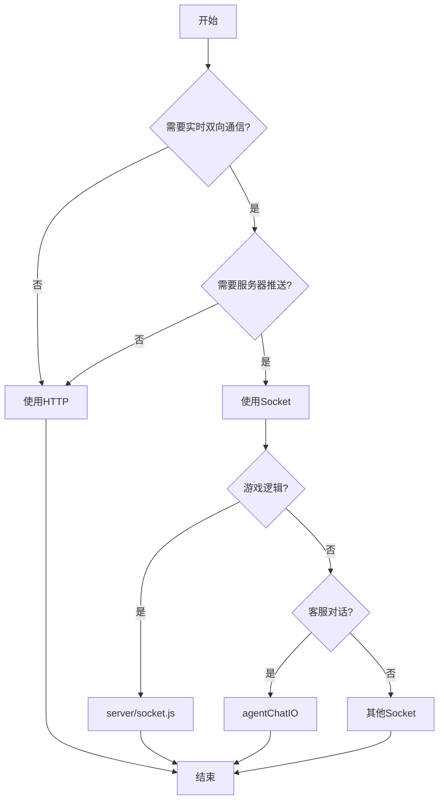

# 通信方式决策矩阵

本文档定义了能量山项目中不同功能模块应使用的通信方式，以及如何正确选择和实现。

---

## 决策流程

### 何时使用 HTTP vs Socket



### 决策检查清单

| 问题 | 回答 | 选择 |
|------|------|------|
| 是否需要实时更新？ | 是 | Socket |
| 是否需要服务器主动推送？ | 是 | Socket |
| 是否只是简单的请求-响应？ | 是 | HTTP |
| 是否需要多用户同步？ | 是 | Socket |
| 是否需要后台操作？ | 是 | HTTP |

---

## 场景对照表

### 游戏模块

| 功能 | 通信方式 | 核心文件 | 实现要点 |
|------|---------|----------|----------|
| 节点占据 | Socket | `server/socket.js` | 服务端计算所有权 |
| 节点移动 | Socket | `server/socket.js` | 广播给所有可见玩家 |
| PK发起 | Socket | `server/socket.js` | 服务端计算结果 |
| PK响应 | Socket | `server/socket.js` | 双向通信 |
| 能量变化 | Socket | `server/socket.js` | 实时同步 |
| 游戏状态同步 | Socket | `server/socket.js` | 定期广播 |

### 客服模块

| 功能 | 通信方式 | 核心文件 | 实现要点 |
|------|---------|----------|----------|
| 发送消息 | Socket | `server/socket.js` (agentChatIO) | 实时推送 |
| 接收AI回复 | Socket | `server/socket.js` | 流式响应 |
| typing状态 | Socket | `server/socket.js` | 实时同步 |
| 会话切换 | Socket | `server/socket.js` | 重新join房间 |

### 用户模块

| 功能 | 通信方式 | 路由文件 | 备注 |
|------|---------|----------|------|
| 用户注册 | HTTP | `server/routes/auth.js` | POST /api/auth/register |
| 用户登录 | HTTP | `server/routes/auth.js` | POST /api/auth/login |
| 获取用户信息 | HTTP | `server/routes/auth.js` | GET /api/auth/me |
| 修改用户资料 | HTTP | `server/routes/auth.js` | PUT /api/auth/profile |

### 内容模块

| 功能 | 通信方式 | 路由文件 | 备注 |
|------|---------|----------|------|
| 获取帖子列表 | HTTP | `server/routes/plaza.js` | 分页查询 |
| 发布帖子 | HTTP | `server/routes/plaza.js` | POST |
| 点赞/评论 | HTTP | `server/routes/plaza.js` | POST |
| 获取播客列表 | HTTP | `server/routes/podcast.js` | GET |
| 上传音频 | HTTP | `server/routes/podcast.js` | multipart/form-data |

### 管理模块

| 功能 | 通信方式 | 路由文件 | 备注 |
|------|---------|----------|------|
| 管理员登录 | HTTP | `server/routes/admin.js` | POST |
| 用户管理 | HTTP | `server/routes/admin.js` | CRUD |
| 配置管理 | HTTP | `server/routes/admin.js` | CRUD |
| 数据统计 | HTTP | `server/routes/admin.js` | GET |

---

## Socket 核心入口

### 主游戏 Socket

```javascript
// server/socket.js
const gameIO = io('/game', {
  cors: { origin: '*' }
});

// 事件命名空间
gameIO.on('connection', (socket) => {
  // 处理游戏事件
});
```

### 客服 Socket

```javascript
// server/socket.js
const agentChatIO = io('/agent-chat', {
  cors: { origin: '*' }
});

// 客服对话事件
agentChatIO.on('connection', (socket) => {
  // 处理客服对话
});
```

---

## 正确实现模式

### HTTP 路由中调用 Socket（正确做法）

**不要**在HTTP路由中直接emit Socket事件，应该抽离为独立函数：

```javascript
// server/services/socket-helper.js
/**
 * 广播用户能量变化
 * @param {number} userId - 用户ID
 * @param {number} newEnergy - 新能量值
 */
function broadcastEnergyChange(userId, newEnergy) {
  const gameIO = require('../socket').getGameIO();
  if (gameIO) {
    gameIO.to(`user:${userId}`).emit('energy_update', {
      user_id: userId,
      energy: newEnergy
    });
  }
}

module.exports = { broadcastEnergyChange };
```

```javascript
// server/routes/plaza.js
const { broadcastEnergyChange } = require('../services/socket-helper');

router.post('/claim-treasure', authenticateToken, async (req, res) => {
  // 业务逻辑...
  await db.execute('UPDATE users SET energy = energy + ? WHERE id = ?', [amount, userId]);

  // 广播能量变化（解耦）
  broadcastEnergyChange(userId, newEnergy);

  res.json({ success: true });
});
```

### Socket 中调用外部服务（正确做法）

```javascript
// server/socket.js
const aiProvider = require('./utils/minimax');

socket.on('send_message', async (data) => {
  // 抽离为独立函数
  await handleAIChatResponse(socket, data);
});
```

---

## 错误模式（避免）

### 错误1：HTTP中直接操作Socket

```javascript
// 错误：HTTP路由中直接emit
router.post('/action', authenticateToken, async (req, res) => {
  const io = req.app.get('io');
  io.emit('event', data);  // 错误！
  res.json({ success: true });
});
```

**正确做法**：抽离为独立服务函数

### 错误2：Socket中处理复杂业务

```javascript
// 错误：Socket中处理所有业务逻辑
socket.on('complex_action', async (data) => {
  // 大量业务逻辑...
  // 错误！难以测试和维护
});
```

**正确做法**：在服务层处理业务，Socket只做通信

### 错误3：忘记广播

```javascript
// 错误：只更新数据库，没广播
await db.execute('UPDATE ...');
res.json({ success: true });
// 客户端不会收到更新！
```

**正确做法**：确保同步广播

---

## 常见问题

### Q1：如何确定新功能用什么通信方式？

1. 需要多用户实时同步？→ Socket
2. 需要服务器主动推送？→ Socket
3. 只是 CRUD？→ HTTP

### Q2：功能写在HTTP但实际不生效？

检查功能是否需要Socket通信。客服对话、游戏操作都是Socket通信，逻辑必须在 `server/socket.js` 中实现。

### Q3：如何测试Socket功能？

使用 Socket.io 客户端或 `socket.test.js` 测试文件：

```javascript
const io = require('socket.io-client');

const socket = io('http://localhost:3000/game', {
  auth: { token: 'test-token' }
});

socket.on('connect', () => {
  console.log('Connected');
  socket.emit('player_action', { /* data */ });
});
```

---

## 相关文档

- [AGENTS.md](../AGENTS.md) - 项目入口文档
- [server/socket.js](../server/socket.js) - Socket核心实现
- [server/routes/agent-chat.js](../server/routes/agent-chat.js) - 客服HTTP接口
